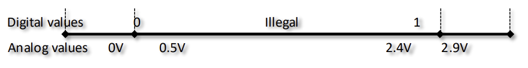

---
aliases:
  - COMP2611 index
  - COMP2611
  - Computer Organization
tags:
  - flashcard/active/ass
  - COMP2611
---

# COMP2611

## Lecture 1
## Information about the course:
- ### Basic information:
  - all learning materials are on course webpage: https://course.cse.ust.hk/comp2611/
  - the canvas is for:
    - homeworks and PA submission
    - grades checking
  - Piazza is the forum for Q&A related to the course
  - each week we have:
    - 2 1.5 hours lectures
    - 1 hour tutorial
    - 1 hour lab 
    - all optional 
  - Tutorial and lab start in week 4 (Feb 23-27)
  - Tutorials and labs are meant for supplementing and revision
- ### Grading scheme
  - 4 individual written homeworks (15%)
    - Roughly releasing in week 3, 5, 8, 11
    - due in one or two weeks
  - Midterm exam (30%) 
    - March 20 (Friday) 7:00pm, LTA & LTG, week 7
  - 1 individual programming project (15%)
    - Roughly to be released in week 9
    - due in one month (last day of Spring term)
  - Final exam (40%)
    - mid/late May

- ### Rough course schedule:
  - week 3: homework 1
  - week 4: Tutorial and lab starts
  - week 5: homework 2
  - week 7: Midterm (Mar 20 7pm)
  - week 8: Homework 3 
  - Week 9: PA release
  - Week 11: Homework 4 
- ### Academic Integrity:
  - Course homework and project should be individual work
- ### What does the course teach:
  - How does a computer work internally
  - How can we get electricity to somehow add two numbers
  - What happens when programs are executed by the computer
  - How do we design programming languages and hardware to work together
  - How do we make computer faster
- ### Learning outcomes
  - Understand [digital logic](../../../notes/digital_logic.md) and how to build small circuits involved in computer systems
  - Able to describe the interaction between software and hardware as well as the [(ISA) Instruction Set Architecture](../../../notes/ISA.md)
  - Write and execute a small program of a few hundred lines of [assembly language](../../../notes/assembly.md)
  - Define the basic concepts of computer hardware, including processor(datapath, control) and memory
  - Describe the organizational paradigms that determine the capability and performance of computer systems
- ### Topics
  - Brief digital circuit
    - Topic 1: Digital logic (combinational and sequential) 
  - Data representation and arithmetic
    - Topic 2: Data representation (integer, fractional, character)
    - Topic 3: Computer arithmetic (Addition, subtraction, multipliation, division) and ALU
  - ISA and assembly
    - Topic 4: ISA and MIPS Assembly Language   
  - Computer Architecture
    - Topic 5: Processor (datapath and control) and pipeline 
    - Topic 6: Memory system (cache, virtual memory)

## Introduction:
- ### Common number system
  - A **number system** defines how numbers can be represented using distinct symbols
  - A number can be represented differently in different systems:
    - For example, $(2A)_{16}$ and $(101010)_{2}$ both equals to $(42)_{10}$
- ### Positional Notation 
  - Each digit position has an associated weight:
    > $642_{(10)} = 6 \times 10^{2} + 4 \times 10^{1} + 2 \times 10^{0}$
  - As formula
    > $d_{n - 1} \times R^{n - 1} + d_{n - 2} \times R^{n - 2} + ... + d_{1} \times R^{1} + d_{0} \times R^{0}$
    - where `d` stands for digits and `R` stands for radix (base)
- ### Common number system:
|System|Base|Symbols|Remark|
|------|----|-------|------|
|Decimal|10|0, 1, ..., 9| Used by people|
|Binary|2|0, 1| Used by digital computers|
|Hexadecimal|16|0, 1, ... 9, A, B, ... F| Great way to concisely represent a binary sequence|

- ### Binary (base 2)
  - Used to model the series of computer signals computers use to represent information
  - **Base 2**
    - two symbols:
      - `0, 1`
      - binary digits
      - also known as "bits"
      - A sequence of bits (bit sequence) usually work together (?)
- ### Classes of computer
  - Personal computers
    - General purpose, variety of software
    - Subject to cost/performance trade-off
  - Server computers
    - Network based
    - high capacity, performance, reliability
    - Range from small servers to building sized 
  - Super computers
    - high-end scientific and engineering calculations
    - Highest capability but represent a small fraction of the computer market
  - Embedded computers
    - Hidden as components of systems
    -  Stringent power/performance/cost constraints
- ### Below a computer program:
  - Application software
    - written in high-level language
  - System software
    - Compiler: Translates HLL code to machine code
  - Operating system: Service code
    - Handling input/output
    - Managing memory and storage
    - Scheduling tasks & sharing resources
  - Hardware
    - Processor, memory, I/O controllers

- ### Levels of program code
  - High-level language
    - level of abstraction closer to problem domain (?)
  - Provides for productivity and portability
  - Assembly language:
    - Textural representations of instructions
    - Symbolic language
  - Hardware representation 
    - Binary digits (bits)
    - Encoded instructions and data
- ### Levels of abstraction
  - both hardware and software are organized in hierarchical layers
    - which helps to cope with system complexity
  - lower level details are **hidden** to offer a simpler view at the higher levels
  - Interaction between levels occurs through well-defined **interface**
    - Interface between hardware and software: [ISA (Instruction Set Architecture)](../../../notes/ISA.md)

- ### Components of computer (there are 5 basic components)
  - Input: 
    - to communicate with the computer
    - they are data and instructions tranferred to the memory 
  - Output: 
    - To communicate with the user
    - Data is read from the memory
  - Memory:
    - a large storage to keep and instructions and data
  - [Processor](../../../notes/processor.md) consisting of:
    - Datapath (?)
    - Control 
- ### Concluding remarks:
  - Recognize the five basic components of a computer
    - Input, output, memory, processor, datapath, control 
  - Understand the principles of abstraction
    - helps to cope with design complexity by hiding low-level details
    - level of program codes: high-level language (c++), low-level language (assembly) and machine code
  - Instruction set architecture:
    - the hardware-software interface
  - Recognize the technology trend:
    - Cost/performance is improving due to underlying technology development.
## Lecture 2 (digital logic):
- content includes:
  - how are bits represented and handled in the hardware
  - how to design a simple circuit to perform an abstract task (e.g. addition)
- ### Power of bit:
  - Analog vs Digital waveforms:
    - digital: only assumes discrete values
    - analog: values vary over a broad range continously
  - The electronics inside modern computers are digital: they operate with only two voltage levels of interest
  - typical voltage assignment:
    - 
        - `1`: any voltage between 2.4V to 2.9V
        - `0`: any voltage between 0V to 0.5V
- ### bit in computer
  - bits are the basis for binary number representation in digital computers 
  - operations in computer work on bits
  - combining bits into patterns following some conventions or rules defined in [ISA](../../../notes/ISA.md), which allows:
    - number representations:
      - integers
      - Fractions and real numbers, ...
    - instructions encoding
      - operations (e.g. nop)
      - operands   (e.g. `r8` and `0x8` in `mov r8, 0x8`)
- ### truth table:
  - mathematical table used into logic
  - In connection with boolean algebra boolean functions 
  - shows how the truth and falsity of the propositions (output) varies with the components (inputs)
  - One column for each input variable and one column for each outputs variable
  - Each row of the truth table contains one possible configuration of the input variables
- ### Boolean algebra and logic operations
  - Everything in digital computers is binary, the theorical model behind is boolean algebra 
  - Algebra: values, variables, operations 
  - In Boolean algebra:
    - The values are the symbols 0 (FALSE) and 1 (TRUE)
    - A boolean variable or binary variable is one that can only take two values:   
      - 0
      - 1
    - Three fundamental logic operations in boolean variables: `AND`, `OR`, `NOT`
    - other commonly used logic operations: `NAND`, `NOR`, `XOR`
    - [Logic gates](../../../notes/logic_gates.md) implement the above logic operations and built up by transistors
- ### [Logic gates](../../../notes/logic_gates.md)
- ### Logic function
  - Any operation in digital circuit can be described by truth table or logical function
  - A logic function is a function that takes binary variable (contains only 0 and 1) and outputs a binary variable
  - <u>Three fundamental</u> **NOT**, **AND**, **OR** logic operations are at the center of all operations in modern computers
  - Logical functions can be represented in many ways:
    - Truth table
    - Logical expressions
    - Graphical form (e.g. K-map)
## Lecture 3 ([combinational logic](../../../notes/combinational_logic.md))
- ### Simple combinational Logic circuits
  - [Multiplexor/de-multiplexor](../../../notes/multiplexor.md)
  - [Decoder]((../../../notes/decoder.md))/[Encoder](../../../notes/encoder.md)
  - [Two-level logic](../../../notes/two_level_logic.md) and [Programmable Logic Array (PLA)](../../../notes/PLA.md)
  - The above circuits and be implemented with `AND`, `OR`, `NOT` gates only
  - They are **high-level building blocks** that are commonly seen in combinational logic
- ### Logic Circuit Design Process
  - a simple logic circuit design process involves:
    - problem specification
    - truth table derivation
    - derivation of logical expression
    - simplification of logical expression
    - implementation
- ### Example: [3-person Majority vote](../../../notes/3_person_vote.md)
  - [canonical forms](../../../notes/canonical_form.md)
  - [minterm](../../../notes/minterm.md) and [maxterm](../../../notes/maxterm.md)
- ### [PLA](../../../notes/PLA.md)

## Lecture 4
- ## logical equivalence
  - Proving logical equivalence of two circuits
    - Derive the logical expression for the output of each circuit
    - show that these two expression are equivalent
  - **Method 1: truth table**
    - for every combination of inputs, if both expression yield the same output. Then that means they are equivalent.
    - Good for logical expressions with small number of variables.
  - **Method 2: algebraic manipulation**
    - with help of boolean algebra
- ## Logic exprezsion simplification:
  - motivation: truth table method is not good enough. It could grow very large in size and become tedious as well as time consuming to write.
    - $n$ inputs means $2^n$ rows in the truth table
  - logic exxpression are better in this case
    - however there are equivalent logic expressions for the same truth table (?)
    - each of them lead to a circuit implementation
  - simplifying logic expressions leads to simpler and cheaper circuit design
    - because lesser components
  - There are many methods, algorithms and tools for simplifying logic expressions:
    - boolean algebra (math tool)
    - Karnaugh-maps (k-maps) (graphical tool)
- ## Boolean algebra revisit:
  - Boolean algebra is the algebra of logic 
    - deals with study of binary variables and logical operations
  - It transform logical statements into math symbols
    - calculate the truth or falsity of the statemenets
      - by using rules
  - [laws of boolean algebra](../../../notes/Boolean_algebra_laws.md) are powerful tools
    - to simplify the logic equations
- ## K-map:
  - K-Map is the graphical representation of the truth table or logic fucntion
  - In a K-Map, each cell represents one possible [minterm](../../../notes/minterm.md)
  - Cells are arranged following the **Gray Code** 
    - Gray code: two adjacent minterm in the table only differ by **one** variable
- ## K-map simplification rules:
  - find largest size groups of adjacent cells at 1 (at 1?)
  - it can only be:
    - $2^N (1, 2, 4, 8, ..)$ adjacent cells in each group
  - K-Map is toroid
    - like a circle
    - rightmost cells are considered adjacent to leftmost cells 
    - topmost cells are considered as adjacent to bottommost cells
  - larger groups 
    - fewer inputs to [`AND` gate](../../../notes/AND_gate.md)
  - Fewer groups
    - fewer `AND` gate and fewer inputs to [`OR` gate](../../../notes/OR_gate.md)
  - best group might not be unique