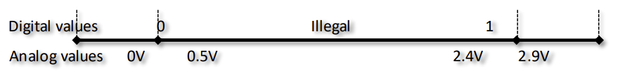

---
aliases:
  - COMP2611 index
  - COMP2611
  - Computer Organization
tags:
  - flashcard/active/ass
  - COMP2611
---

# COMP2611

## Lecture 1
## Information about the course:
- ### Basic information:
  - all learning materials are on course webpage: https://course.cse.ust.hk/comp2611/
  - the canvas is for:
    - homeworks and PA submission
    - grades checking
  - Piazza is the forum for Q&A related to the course
  - each week we have:
    - 2 1.5 hours lectures
    - 1 hour tutorial
    - 1 hour lab 
    - all optional 
  - Tutorial and lab start in week 4 (Feb 23-27)
  - Tutorials and labs are meant for supplementing and revision
- ### Grading scheme
  - 4 individual written homeworks (15%)
    - Roughly releasing in week 3, 5, 8, 11
    - due in one or two weeks
  - Midterm exam (30%) 
    - March 20 (Friday) 7:00pm, LTA & LTG, week 7
  - 1 individual programming project (15%)
    - Roughly to be released in week 9
    - due in one month (last day of Spring term)
  - Final exam (40%)
    - mid/late May

- ### Rough course schedule:
  - week 3: homework 1
  - week 4: Tutorial and lab starts
  - week 5: homework 2
  - week 7: Midterm (Mar 20 7pm)
  - week 8: Homework 3 
  - Week 9: PA release
  - Week 11: Homework 4 
- ### Academic Integrity:
  - Course homework and project should be individual work
- ### What does the course teach:
  - How does a computer work internally
  - How can we get electricity to somehow add two numbers
  - What happens when programs are executed by the computer
  - How do we design programming languages and hardware to work together
  - How do we make computer faster
- ### Learning outcomes
  - Understand [digital logic](../../../notes/digital_logic.md) and how to build small circuits involved in computer systems
  - Able to describe the interaction between software and hardware as well as the [(ISA) Instruction Set Architecture](../../../notes/ISA.md)
  - Write and execute a small program of a few hundred lines of [assembly language](../../../notes/assembly.md)
  - Define the basic concepts of computer hardware, including processor(datapath, control) and memory
  - Describe the organizational paradigms that determine the capability and performance of computer systems
- ### Topics
  - Brief digital circuit
    - Topic 1: Digital logic (combinational and sequential) 
  - Data representation and arithmetic
    - Topic 2: Data representation (integer, fractional, character)
    - Topic 3: Computer arithmetic (Addition, subtraction, multipliation, division) and ALU
  - ISA and assembly
    - Topic 4: ISA and MIPS Assembly Language   
  - Computer Architecture
    - Topic 5: Processor (datapath and control) and pipeline 
    - Topic 6: Memory system (cache, virtual memory)

## Introduction:
- ### Common number system
  - A **number system** defines how numbers can be represented using distinct symbols
  - A number can be represented differently in different systems:
    - For example, $(2A)_{16}$ and $(101010)_{2}$ both equals to $(42)_{10}$
- ### Positional Notation 
  - Each digit position has an associated weight:
    > $642_{(10)} = 6 \times 10^{2} + 4 \times 10^{1} + 2 \times 10^{0}$
  - As formula
    > $d_{n - 1} \times R^{n - 1} + d_{n - 2} \times R^{n - 2} + ... + d_{1} \times R^{1} + d_{0} \times R^{0}$
    - where `d` stands for digits and `R` stands for radix (base)
- ### Common number system:
|System|Base|Symbols|Remark|
|------|----|-------|------|
|Decimal|10|0, 1, ..., 9| Used by people|
|Binary|2|0, 1| Used by digital computers|
|Hexadecimal|16|0, 1, ... 9, A, B, ... F| Great way to concisely represent a binary sequence|

- ### Binary (base 2)
  - Used to model the series of computer signals computers use to represent information
  - **Base 2**
    - two symbols:
      - `0, 1`
      - binary digits
      - also known as "bits"
      - A sequence of bits (bit sequence) usually work together (?)
- ### Classes of computer
  - Personal computers
    - General purpose, variety of software
    - Subject to cost/performance trade-off
  - Server computers
    - Network based
    - high capacity, performance, reliability
    - Range from small servers to building sized 
  - Super computers
    - high-end scientific and engineering calculations
    - Highest capability but represent a small fraction of the computer market
  - Embedded computers
    - Hidden as components of systems
    -  Stringent power/performance/cost constraints
- ### Below a computer program:
  - Application software
    - written in high-level language
  - System software
    - Compiler: Translates HLL code to machine code
  - Operating system: Service code
    - Handling input/output
    - Managing memory and storage
    - Scheduling tasks & sharing resources
  - Hardware
    - Processor, memory, I/O controllers

- ### Levels of program code
  - High-level language
    - level of abstraction closer to problem domain (?)
  - Provides for productivity and portability
  - Assembly language:
    - Textural representations of instructions
    - Symbolic language
  - Hardware representation 
    - Binary digits (bits)
    - Encoded instructions and data
- ### Levels of abstraction
  - both hardware and software are organized in hierarchical layers
    - which helps to cope with system complexity
  - lower level details are **hidden** to offer a simpler view at the higher levels
  - Interaction between levels occurs through well-defined **interface**
    - Interface between hardware and software: [ISA (Instruction Set Architecture)](../../../notes/ISA.md)

- ### Components of computer (there are 5 basic components)
  - Input: 
    - to communicate with the computer
    - they are data and instructions tranferred to the memory 
  - Output: 
    - To communicate with the user
    - Data is read from the memory
  - Memory:
    - a large storage to keep and instructions and data
  - [Processor](../../../notes/processor.md) consisting of:
    - Datapath (?)
    - Control 
- ### Concluding remarks:
  - Recognize the five basic components of a computer
    - Input, output, memory, processor, datapath, control 
  - Understand the principles of abstraction
    - helps to cope with design complexity by hiding low-level details
    - level of program codes: high-level language (c++), low-level language (assembly) and machine code
  - Instruction set architecture:
    - the hardware-software interface
  - Recognize the technology trend:
    - Cost/performance is improving due to underlying technology development.
## Lecture 2 (digital logic):
- content includes:
  - how are bits represented and handled in the hardware
  - how to design a simple circuit to perform an abstract task (e.g. addition)
- ### Power of bit:
  - Analog vs Digital waveforms:
    - digital: only assumes discrete values
    - analog: values vary over a broad range continously
  - The electronics inside modern computers are digital: they operate with only two voltage levels of interest
  - typical voltage assignment:
    - 
        - `1`: any voltage between 2.4V to 2.9V
        - `0`: any voltage between 0V to 0.5V
- ### bit in computer
  - bits are the basis for binary number representation in digital computers 
  - operations in computer work on bits
  - combining bits into patterns following some conventions or rules defined in [ISA](../../../notes/ISA.md), which allows:
    - number representations:
      - integers
      - Fractions and real numbers, ...
    - instructions encoding
      - operations (e.g. nop)
      - operands   (e.g. `r8` and `0x8` in `mov r8, 0x8`)
- ### truth table:
  - mathematical table used into logic
  - In connection with boolean algebra boolean functions 
  - shows how the truth and falsity of the propositions (output) varies with the components (inputs)
  - One column for each input variable and one column for each outputs variable
  - Each row of the truth table contains one possible configuration of the input variables
- ### Boolean algebra and logic operations
  - Everything in digital computers is binary, the theorical model behind is boolean algebra 
  - Algebra: values, variables, operations 
  - In Boolean algebra:
    - The values are the symbols 0 (FALSE) and 1 (TRUE)
    - A boolean variable or binary variable is one that can only take two values:   
      - 0
      - 1
    - Three fundamental logic operations in boolean variables: `AND`, `OR`, `NOT`
    - other commonly used logic operations: `NAND`, `NOR`, `XOR`
    - [Logic gates](../../../notes/logic_gates.md) implement the above logic operations and built up by transistors
- ### [Logic gates](../../../notes/logic_gates.md)
- ### Logic function
  - Any operation in digital circuit can be described by truth table or logical function
  - A logic function is a function that takes binary variable (contains only 0 and 1) and outputs a binary variable
  - <u>Three fundamental</u> **NOT**, **AND**, **OR** logic operations are at the center of all operations in modern computers
  - Logical functions can be represented in many ways:
    - Truth table
    - Logical expressions
    - Graphical form (e.g. K-map)
## Lecture 3 ([combinational logic](../../../notes/combinational_logic.md))
- ### Simple combinational Logic circuits
  - [Multiplexor/de-multiplexor](../../../notes/multiplexor.md)
  - [Decoder]((../../../notes/decoder.md))/[Encoder](../../../notes/encoder.md)
  - [Two-level logic](../../../notes/two_level_logic.md) and [Programmable Logic Array (PLA)](../../../notes/PLA.md)
  - The above circuits and be implemented with `AND`, `OR`, `NOT` gates only
  - They are **high-level building blocks** that are commonly seen in combinational logic
- ### Logic Circuit Design Process
  - a simple logic circuit design process involves:
    - problem specification
    - truth table derivation
    - derivation of logical expression
    - simplification of logical expression
    - implementation
- ### Example: [3-person Majority vote](../../../notes/3_person_vote.md)
  - [canonical forms](../../../notes/canonical_form.md)
  - [minterm](../../../notes/minterm.md) and [maxterm](../../../notes/maxterm.md)
- ### [PLA](../../../notes/PLA.md)

## Lecture 4
- ## logical equivalence
  - Proving logical equivalence of two circuits
    - Derive the logical expression for the output of each circuit
    - show that these two expression are equivalent
  - **Method 1: truth table**
    - for every combination of inputs, if both expression yield the same output. Then that means they are equivalent.
    - Good for logical expressions with small number of variables.
  - **Method 2: algebraic manipulation**
    - with help of boolean algebra
- ## Logic expression simplification:
  - motivation: truth table method is not good enough. It could grow very large in size and become tedious as well as time consuming to write.
    - $n$ inputs means $2^n$ rows in the truth table
  - logic exxpression are better in this case
    - however there are equivalent logic expressions for the same truth table (?)
    - each of them lead to a circuit implementation
  - simplifying logic expressions leads to simpler and cheaper circuit design
    - because lesser components
  - There are many methods, algorithms and tools for simplifying logic expressions:
    - boolean algebra (math tool)
    - Karnaugh-maps (k-maps) (graphical tool)
- ## Boolean algebra revisit:
  - Boolean algebra is the algebra of logic 
    - deals with study of binary variables and logical operations
  - It transform logical statements into math symbols
    - calculate the truth or falsity of the statemenets
      - by using rules
  - [laws of boolean algebra](../../../notes/Boolean_algebra_laws.md) are powerful tools
    - to simplify the logic equations
- ## K-map:
  - K-Map is the graphical representation of the truth table or logic fucntion
  - In a K-Map, each cell represents one possible [minterm](../../../notes/minterm.md)
  - Cells are arranged following the **Gray Code** 
    - Gray code: two adjacent minterm in the table only differ by **one** variable
- ## K-map simplification rules:
  - find largest size groups of adjacent cells that are 1
  - it can only be:
    - $2^N (1, 2, 4, 8, ..)$ adjacent cells in each group
  - K-Map is toroid
    - like a circle
    - rightmost cells are considered adjacent to leftmost cells 
    - topmost cells are considered as adjacent to bottommost cells
  - larger groups 
    - fewer inputs to [`AND` gate](../../../notes/AND_gate.md)
  - Fewer groups
    - fewer `AND` gate and fewer inputs to [`OR` gate](../../../notes/OR_gate.md)
  - best group might not be unique


# Lecture 5
## S-R Latch: Simple Storage Element
- S-R latches (set-reset latches)
  - unclocked memory element
  - R is used to 'reset' or 'clear' the element
  - S is used to set the element
  - If both R and S are 'not chosen', output is in 'Quiescent' state
    - hold its previous value 
    - basically storing a value
    - act as memory
    - can be either 0 or 1
  - Usually built from a pair of cross coupled NOR (or NAND) gates.
## Reset S-R latch
- Suppose we start with Q = 1, then changing R to 1 clears it and make it 0
- 

## Set the S-R latch
- Suppose we start with Q = 0, then changing S to 1 would 'set' it, stores 1 to the Q
- 


# Lecture 9 
- the start of "MIPS ISA and Assembly" lecture notes
- the "words" of a machine language are called {{**instructions**}}
- its "vocabulary" is called an {{instruction set}}
- In the form of written by the programmer -> {{assembly language}}
## ISA (instruction set architecture)
- ISA is the part of the processor that is both visible to the programmer and the compiler writer.
  - the native data types
  - instructions
  - registers
  - [addressing modes](../../../notes/addressing-mode.md)
  - memory architecture
  - interrupt and external handling
  - external I/O
- ISA includes the specification of the set of opcodes and the native commands implemented by a processor.
## The MIPS instruction Set
- MIPS (Microprocessor without Interlocked Pipeline Stages)
  - An example of RISC (Reduced Instruction Set Computer) design 
  - utilizes a small, high-optimized set of instructions
  - simple, clean MIPS processor whose architecture is easy to learn and understand.
  - RISC ISAs now have large share of embedded core in the market.
## ISA vs Assembly language
- ISA standardizes a public interface for the processor which should act as a basis to write programs.
- Assembly language is the term for a programming language.
- Ideally for each ISA, there is an Assembly language.
- But it is not uncommon that there is more than one or subtle variations of the Assembly language for a particular ISA.
- The Assembly language is defined by the Assembler.
## Why ISA
- If no ISA:
  - The "vocabulary" of the hardware can change from time to time.
  - No guarantee of how the instructions would look like in the next product.
- From programmers' point of view:
  - potentially need to reprogram everytime when we upgrade our computer.
- From system designers' point of view:
  - Hardware improvement may lead to incompatibility with existing applications.
- With ISA, all the above problems are solved:
  - All software developers have to do is conforming to the machine's ISA.
  - No need to worry about how hardware implements the instructions.
  - All system designers have to do is to ensure that the new processor implementations are backward compatible with ISA's definition, instead of new applications.
## Deisgn principles of (RISC) ISA:
- Simplicity favors regularity
  - {{Each instructions has a fixed number of operands in MIPS}}
  - Intel architecture supports a variation of number of operands
  - Regularity makes the implementation {{simpler}}
  - Simplicity allows a higher performance at a {{lower cost}}
- Smaller is faster
  - having a small enough number of registers leads to a faster processor
  - Larger number of registers, longer the electronic signal must travel
- Make common case fast
  - Constant operands occurs frequently
  - Encode constants inside arithmetic instructions,
    - much faster than if constants are loaded from the memory unit
- Good design demands good compromises
## Basic instructions
- see [MIPS instructions](../../../notes/mips_instr.md)
## Register operands
> MIPS data processing instructions operate on registers
>
  
- registers are very {{**fast temporary storage**}} on the processor used to hold variables
- The concept of variable vs register:
  - variables are logical storage, the amount is unlimited.
  - registers are actual physical storage, the amount is fixed on a particular processor.

## MIPS registers
- there are 32 general purpose registers on MIPS, each are 32 bits in size
  - Used for frequently accessed data (32-bit data is called a "word")
  - Numbered 0 to 31
  - Saved registers `$s0 - $s7` or `$16 - $23` (they are the same) are called the "Saved Registers" used to hold general variables of a program
  - Temporary registers `$t0 - $t7` or `$8 - $15` (they are the same) are called the "Temporary Registers: used to hold temporary variables of a program or during a particular processor of a program (since high level programming language like c++ and assembly are not exactly one-to-one)
  - `$zero` or `$0` register is called the "Zero register" used to hold just a constant value - 0

## How many registers are needed
- If:
  - too few: not enough to hold a large number of variables in a program
  - too many: leads to a complicated processor design, a longer clock cycle and lower the performance.
- need: good balance
  - provide enough number of registers 
  - keep the clock cycle short

## Data transfer in MIPS
- The main memory unit provides a very large storage
  - Large composite data like arrays, structures and dynamic data are all kept in the memory
- MIPS' design disallows data stored in memory to be manipulated directly
  - Data must be first transferred to registers are manipulation 
  - and then transfer back from registers to the memory.
- the following two instructions are exactly designed for this purpose:
  - `lw` (load a word) moves data from memory to a register
  - `sw` (store a word) moves data from a register to a specific memory location

## Addressing Memory Location
- Memory is a consecutive arrangement of storage locations


- Each memory location is indexed by an address (for it to be compact, the addresses are usually in hexidecimal format when viewed with a debugger)
  - Most architecture address individual bytes
  - Addresses of sequential 8-bit bytes differ by 1
  - Addresses of sequential 32-bit words differ by 4
- To specify the address of the memory location of any array element in assembly language, we need:
  - Base address: starting address of the array
  - Offset: distance of target location from the starting base address. It can be either negative or positive.

## Endianness
- talks about the byte ordering and placement in the memory
- for details see: [endianness](../../../notes/endianness.md)

## Immediate operands
- To do an expression like `reigster1 = register2 +/- constant`
- `addi` means "add immediate" (immediate is the constant)
  - constant part is always the last operand
- Zero register:
  - `$zero` or `$0` register holds a constant 0, read-only, can't be overwritten
  - we can play some tricks using it and `add`, `addi` instruction:
    - move between registers:
      - `add $t0, $0, $s0`
    - initialize a register to a constant:
      - `addi $t0, $0, 5`
  
## Memory vs Register vs Constant
- Major difference is the instruction's execution time.
  - **Memory** is outside the processor, far from the processing unit
    - Memory operand takes a long time to load and store
  - **Register** is inside the processor, close to the processing unit
    - Register operand takes a short time to get the value 
  - **Constant** already encoded in the instruction 
    - Constant operand value is immediately available (that's probably why they are called the **immediate**)
  - A program is a mixture of these 3 types of operations

## Logical Operations
- `and $rd, $rs, $rt` 
- `or $rd, $rs, $rt` 
- `nor $rd, $rs, $rt` (not-or)
- these are all bitwise logical operations act on each bit of `$rs` with the corresponding bit of `$rt`
- the results are stored in `$rd` 
- `andi` and `ori` are the immediate version

## shift
- `sll $rd, $rs, shamt`
- `srl $rd, $rs, shamt`
- they are "shift left logical" and "shift right logical" 
- the `shamt` is the shift amount
- what gets shifted is `$rs`, result stored in `$rd`
- `sll` is basically multiplication by $2^k$ where $k$ is `shamt`
- `srl` is basically division by $2^k$ where $k$ is `shamt`


# Lecture 10
## MIPS Program
- We need to declare variables and arrays in the data segment of a MIPS program
- The compiler recognizes `.data` as the beginning of the data segment
### Example:
```assembly
h: .word 1 2 3 4 ; h is the name or label of the array. The array is of size of 4. And each element is of 32 bit (a word)
s: .word 5
```
- the program beings at `.text` label
### Example:
```
.text
.globl __start:
__start:
```


## How it works:
- when the program is about to run. The data (variables, arrays) declared will be fed into the memory consecutively:


- `h & s` are called labels, they can be viewed as bookmarks of the program
- when `la $s0, h` is executed. The address in bytes referenced by `h` is loaded into the register `$s0`
- e.g. if X = 10000, then `$s0 = 10000`. This means the values of the array `h` store between the 10000th and 10015th byte of the memory.

## Assembler directives
- Directives are commands that are part of the assembler syntax. But not the processor's instruction set.
- MIPS assembler directives begin with a period "."

|.data|the following data items should be tored in data segment|
|-|-|
|.align n|align the next datum in 2^n byte boundary. For example, .align 2 aligns the next value in a word boundary. .align 0 turns off automatic alignment of .half, .word, .float, and .double  directives|
|.ascii str|Store the string in memory but do not null terminate it|
|.asciiz str|Store the string in memory and null terminate it|
|.byte b1, ..., bn| Store the n values in successive bytes of memory|
|.word w1, ..., wn| Store the n 32-bit quantities in successive memory words
|.double d1, ..., dn| Store the n floating point double precision numbers in successive memory locations|
|.text <addr>| The next items are put in user text segment|
|.globl sym| declare the symbol "sym" is global so that it can be referenced from other files|

## Instruction for making decision
- In high-level programming language, decision-making instruction:
  - `if`-statement
- in MIPS, decision-making instructions (or conditional branches):
  - `beq`('branch if equal'):
    - e.g. `beq reg1, reg2, L1`
    - which means the execution flow would branch to `L1` if `reg1` and `reg2` are equal
  - `bne` ('branch if not equal'):
    - e.g. `bne reg1, reg2, L1`
    - goes to `L1` if `reg1` and `reg2` are not equal.

## Loops
- Decisions are important for:
  - choosing between two alternatives found in if-statement
  - iterating a computation-found in loops
- in loops, decisions are important for determining when to stop looping

## Basic blocks
- A basic block is a sequence of instructions that:
  - has no branch, jump instructions (except at the end)
  - has no labels or branch targets (except at the beginning)
- One of the early phrases of compilation is to break the program into many basic blocks
- A compiler identify basic blocks and run optimization
- An advanced processor can accerlerate the execution of basic blocks

## Examples of basic blocks


# Lecture 11
## "Less than" test
- Beside testing the equality, we are often also interested in knowing whether a variable is **less than** or **greater than** other variables.
  - e.g. exit a loop when an array index is less than a specific variable
- `slt` ("set less than")
  - `slt reg1, reg2, reg3`
  - set `reg1` to be 1 if `reg2` is less than `reg3`
  - otherwise, set it to 0
- `slti` ("set less than immediate")
  - `slt reg1, reg2, constant`
  - set `reg1` to be 1 if `reg2` is less than the constant value.

## branch instruction desgin
- MIPS compilers use `beq, bne, slt, slti` and the fixed value 0, which is always available in `$zero`
- to create all comparison operations
- in other words, any comparsion operations can be created with the above 4 MIPS instructions
  - equal, not equal
  - less than, less than or equal
  - greater than, greater than or equal
- why not `blt` (branch less than), `bge` (branch greater or equal), etc.
  - hardware for `<`, `>=` is slower than `=` and `!=`
  - combining with branch involves more work per instructions. Requires a slower clock or longer clock cycle.
  - All instructions penalized. Since The D-flip-flops in the processor for updating things needs to account for the longest clock cycle of an instruction.
  - beq and bne are the common cases

## Branch with zero
- Branch on greater than or equal to zero
  - `bgez $s, label` ; `if ($s >= 0)`
- Branch on greater than zero
  - `bgtz $s, label` ; `if ($s > 0)`
- Branch on less than or equal to zero:
  - `btez $s, label` ; `if ($s <= 0)`
- Branch on less than zero:
  - `bltz $s, label` ; `if ($s < 0)`

## "Jump register" instruction
- another unconditional jump instruction
  - `jr` ("jump register")
    - e.g. `jr reg`
    - jump to the 32-bit address specified by the register: `reg`
- it is usually used for **procedure call** or **case/switch statement**

# Lecture 12 (Machine code)
## Implementating MIPS instructions
- The computer "see" the instruction as machine language or machine code encoded in the binary.
- MIPS instructions
  - Encoded as 32-bit instruction words
  - Broken up into a number of fields
  - Small number of formats encoding operation code (opcode), register numbers.
  - Regularity
- For the details, see [instruction encodings](../../../notes/instruction-encoding.md)

## Design principle #4 (again)
- Good design demands good compromises
- Ways to encode instructions:
  - **variable length** or **fixed length**
- How to choose
  - Use **variable length** to optimize code size to save storage space
  - Use fixed length to optimize performance and reduce complexity
- The compromise that MIPS had chosen is to have fixed length instructions
  - so that the fetch and decode stage are faster and with simpler hardware design.

## Other important MIPS instructions
### Unsigned arithmetic
- `addu $rd, $rs, $rt`
  - "add unsigned"
  - addition ignoring overflow
- `subu $rd, $rs, $rt`
  - "subtract unsigned"

### Load/store a byte
- `lb $rt, offset($rs)`
  - **sign extend** to 32 bits in `$rt`
- `lbu $rt, offset($rs)`
  - **zero extend** to 32 bits in `$rt`
- `sb $rt, offset($rs)`
  - store the rightmost byte in `$rt` to `$rs`

### Logical operations
- `nor $rd, $rs, $rt`
  - "not or" bitwise operation
  - Useful to invert bits in a word. `a NOR b == NOT (a OR b)`
  - `nor $t0, $t1, $zero` simply does a `NOT` operation to invert the bits

### Shift left/right logical variables
- `sllv $rd, $rt, $rs` ; `$rd = $rt << $rs`
- `srlv $rd, $rt, $rs` ; `$rd = $rt >> $rs`

## The stored program concept


- Instructions represented also in binary, just like data
- Instructions and data stored in memory
- Programs can operate on programs
  - e.g., compilers, linkers, ...
- Binary compatibility allows compiled programs to work on different computers
  - standardized ISAs

# Lecture 13 (procedure)
- The lecture was basically about function calls in MIPS

## Supporting Procedures in Computer hardware
- Procedures (also called subroutines) are necessary in any programming language.
- they allow better structuring of programs
- Thus we need the mechanism to jump to other procedures and return from it.

## Supporting prodecures in computer hardware
- necessary steps for executing a procedure:
  - Place the parameters in place where the procedure can access them.
  - Transfer control to the procedure
  - Acquire the storage resources needed for the procedure
  - perform the desired task
  - Place the result in a place where the caller and access it
  - Return control to the point of origin. Since a procedure can be called from several pointers in a program.
- For the details of how the mechanism work, see [function calls](../../../notes/function-call-mips.md)

## MIPS memory layout
- text: program code
- static data: global variables
  - e.g. static variables in C, constant arrays and strings
  - `$gp` initialized to address allowing + or - a particular offset into this segment
- Dynamic data: heap
  - e.g. malloc in C, new in c++, java
- Stack: automatic storage

# Summary of MIPs Architecture Revealed so far
- MIPS operands:
  - 32 registers (32 bits each):
  - 2^30 memory word locations (32 bits each)
    - because a specific memory address in MIPS is also only 32-bit 
    - each memory address only store a specific byte
    - 4 bytes is one word
    - so there are only $2^32 / 4 = 2^32 / 2^2 = 2^30$ many possible words in a 32 bit MIPS proram
- MIPS Instructions:
  - arithmetic: `add`, `sub`, `addi`
  - data transfer: `lw, sw`
  - logical: `and, or, nor, andi, ori, sll, srl`
  - conditional branch: `beq, bne, slt`
  - unconditional jump: `j, jr, jal`
- MIPS instruction formats:
  - R type
  - I type
  - J type (used by `j` and `jal`)

# Lecture 14
## Dealing with 32 bit immediate
- constants are frequently short and fit into 16-bit field for I-type instructions
- But sometimes they are bigger than 16 bits e.g. a 32-bit constant
- Problem:
  - The problem is that: only with the instructions learnt so far. Cannot set the upper 16 bits of a particular register.
- Solution:
  - `lui` ("load upper immediate") (I- type)
    - e.g. `lui reg, constant`
    - set the upper 16 bits of `reg` using the 16 bit `constant`
    - set the lower 16 bits of `reg` to zeros
    - `constant` should not be greater than $2^16$
### Example
- how to load the 32-bit constant below into register `$s0`
  - $0000 0000 0011 1101 0000 1001 0000 0000_{2}$
- Solution:
  - `lui $s0, 61` ; 61 = 0000 0000 0011 1101
  - `ori $s0, $s0, 2304` ; 2304 = 0000 1001 0000 0000 (but what if the initial value of lower 16 bits of `$s0` is not 0

## Assembler Pseudoinstructions 
- **Pseudoinstructions**
- Assembly language that does not have a corresponding machine language. (They need not be implementated directly in the hardware)
- Cost of using a pseudoinstruction
  - The cost just to reverse one single register: `$at`, for use by the assembler

## Example of pseudoinstructions
- **move:**
  - `move $t0, $t1` ; `$t0` gets the value of `$t1`
  - The assembler would then, convert the above instruction into machine language equivalent to the following instruction:
    - `add $t0, $zero, $t1` ; `$t0` gets the value of 0 + `$t1`
- others:
  - `blt` ('branch on less than')
  - `ble` ('branch on less than or equal')
  - `bgt` ('branch on greater than')
  - `bge` ('branch on greater than or equal')

## Addressing modes
- for the details, refer to [addressing modes](../../../notes/addressing-mode.md)

# Lecture 15
- see [this](./rough/rough.md)

# Lecture 16 (ALU)
- see [this](../../../notes/alu.md)

# Lecture 17 (Multiplication)
- see [this](../../../notes/multiplication.md)

# Lecture 18 (Division)
- see [this](../../../notes/division.md)

# Lecture 19-20 (single-cycle datapath):
- See [this](../../../notes/processor.md)

# Lecture 21-22 (Pipeline basics)
## Pipelining principles
- Key characteristics:
  - Multiple tasks are processed simultaneously
  - Ideally, these tasks should be independent of each otherwise we need to make this the case
  - pipelining does not help the latency of a single task
  - it helps the throughput of the entire workload
  - Completion order in pipelined execution = that in sequential execution
- How much can a pipeline improve
  - potentially speedup = {{number of pipeline stages}}
  - the pipeline rate is limited by the slowest pipeline stage
  - Unbalanced lengths of pipeline stages can reduce speedup. Why? 
  - 

## The MIPS PIPELINE
- Pipeline Performance Example
  - Assume time for stages is
    - 100 picoseocnds for register read or write
    - 200 picoseconds for all other stages
  - Compare pipelined datapath with single-cycle datapath
  - 
- Pipeline Performance
  - 
- Pipeline Speedup
  - Pipeline speed is limited by the most time consuming pipeline stage, as the stage determines the duration of a clock cycle
  - If all stages take the same time, the pipeline is well balanced
    - Time between instructions_{pipelined} = Time between instructions_{non pipelined} / Number of stages
  - The speedup equals to {{number of pipeline stages}} (aka depth of the pipeline)
  - If not balanced, speedup is less
  - Pipelining does not improve the latency of a single instruction, it improves the {{throughput}} of the system (i.e. the datapath)
- MIPS Pipelined Datapath
  - Basic idea: take a single-cycle datapath and separate it into 5 pieces. Each piece responsible for a single instruction execution stage.
  - 
- MIPS ISA for pipelining
  - ISA design affects the complexity of pipeline implementation. 
  - MIPS ISA is designed for pipelining
  - All instruction are of the same length (32-bit)
    - Easy to fetch one instruction in first stage of the pipeline and decode it in the second
  - It has just a few similar instruction formats
    - with the source register fields being located in the same place in all instructions, 2nd stage can read the register file while deconding the type of instruction just fetched
  - Memory operands only appear in loads and stores
    - We can use the execute stage to calculate the memory address and then access memory in the follow stage
  - Alignment of memory operands on words boundaries
    - we need not worry about a single data transfer instruction requiring two memory accesses; the data can be transferred between processor and memory in a single pipeline stage
- Pipelining instructions
  - In the processor: Datapath & control, 
    - Each instruction takes multiple steps
    - Each step is independent of each other and takes different datapath
    - 
    - At each cycle, one instruction is fetched and sent to the processor
    - Ideally, after pipeline is fully filled, one instruction completes each cycle
- MIPS Pipeline Stages
  - Execution of each instruction is broken into 5 stages: (in the order of execution)
    - **IF**: Instruction Fetch. Fetch the instruction from memory
    - **ID**: Instruction Decode & register read
    - **EX**: Perform ALU operation (execution)
    - **MEM**: Memory access (read/write) (if necessary)
    - **WB**: Write Back: Write result back to register.
  - Each stage uses a {{different hardware unit}} and takes on clock cycle to complete.
  - instructions can co-exist in the datapath if all of them are in different stages of execution from one another.
- Pipeline Registers
  - Additional pipeline registers are needed
  - Located between the stages, i.e. **IF/ID, ID?EX, EX/MEM, MEM/WB**
  - Hold information produced in the previous cycle and feed them into the next cycle and at the same time isolate the environment so that the new information got from the previous datapath won't come in and affect the result.
- Pipeline Operation
  - Every clock cycle, many instructions are simultaneously executing in a single datapath 
  - Cycle-by-cycle flow of instructions through the pipelined datapath
  - single-clock cycle pipeline diagram
    - shows pipeline usage in a single cycle
    - highlight resources used
  - Multi-clock cycle pipeline diagram 
    - graph of operation over time
- The pipeline operation
  - Ideally 
  - one stage begins in every cycle
  - One stage completes in each cycle.
  - Each instruction takes 5 cycles
  - In each clock cycle, several instructions are active.
  - Different stages are executing different instructions.
  - Difficulty
    - how to generate the control signals
    - we need to set the control signals for each pipeline stage for each instruction.
## Pipeline control (control signal)
- Let's start with a simple design that views the problem in a greatly simplified way
- temporarily ignore data dependence related problems (hazards), and will provide solutions to this problem later.

## Control Signals for each Stage
- The control signals required by each stage are grouped
- Stage 1: Instruction fetch (IF)
  - no control signals,
  - the instruction is read from the instruction memory and PC is updated to PC + 4
- Stage 2: Instruction decode and register read (ID)
  - no control signals
    - RegDst is no longer needed before the decoding stage in pipelined datapath. Because the RegDst would be later provided by the **WB** pipeline register from the last Write Back stage
  - Instructions is decoded and source operands are read from register file.
- Stage3: Execute (EX)
  - need the following control signals
    - {{RegDst}}
    - {{ALUOp}}
    - {{ALUSrc}}
- Stage 4: Memory Access (MEM)
  - need:
    - {{Branch}}
    - {{Memread}}
    - {{MemWrite}}
- Stage 5: Write Back (WB)
  - need:
    - {{MemToReg}}
    - {{RegWrite}}

- Passing the controls
  - use the same control signals derived from instruction as in single-cycle implementation
  - Pipeline control signals too, so that the correct control signals are supplied for each stage of the instruction
  - Control signals are passed to the next stage only if they are required

- The complete datapath:
  -  

## PIPELINE DATAPATH WITH HAZARDS
- The details about the hazards are [here](../../../notes/pipeline.md)

# Lecture 23-25 (Memory system)
- Major Goals of this chapter:
  - how to build a large and fast memory system
  - Introduce the **memory hierarchy** and take advantage of the **principle of locality** (related to cache)
  - Explain basic **cache** concepts
  - Explain basic **virtual memory** concepts

## Memory technology
- Memory Technology Revisit:
  - Memory is the storage for instructions and data
  - RAM (Random Access Memory) technology includes two types
    - Static Ram 
      - used for **cache**
      - 0.5ns - 2.5ns, `$2000 - $5000` per GB
    - Dynamic RAM 
      - mostly used for **main memory**
      - 50ns - 70ns, `$20 - $75` per GB
  - Hard Disk Drive (HDD) or Solid State Drive (SSD)
    - Mostly used for secondary storage
    - 5ms - 20ms, `$0.20 - $2` per GB


- 4x4 DRAM Array
  - it consists of 
    - transistor
      - {{which enable read/write to the capacitor}}
    - capacitor
      - to {{store}} the "value"
    - A memory cell
      - the first DRAM cell was invented in 1966 by robert Dennard, a research A IBM's Thomas J. Watson Research Center
- DRAM Technology
  - consists of bits of data stored in {{separate capacitors}}
  - Capacitors are 
    - structurally simple, only {{one transistor}} and one {{capacitor}} per bit
    - {{High density}} with low cost
  - Major problem of using capacitors:
    - Real-world capacitors are not ideal, hence {{leak electrons}}
    - Information stored in capacitors eventually {{fades}}
    - need to {{recharge the capacitors periodically}} to restore the "values"
    - Read operations {{discharges the electrons}}: read is destructive
  - Because of this refresh requirement, it is called dynamic memory
- SRAM 
  - SRAM is a type of {{semiconductor memory}}
    - each cell is constructed using {{**transistors only**}} (i.e. not capacitors) 
    - Density not as high as DRAM, it is **more expensive** 
    - {{**Does not need to be periodically refreshed**}}, the memory retains its contents as long as {{power remains applied}}
    - read is not destructive in SRAM design; that's why called {{**static**}}

- DRAM vs. SRAM

  - before: discussion always assumed that memory access takes one cycle
    - now: this assumption is {{dropped}}
  - Implicatoin: performance of processor looks bad with this reality.
  - The following will look into ways to minimize the impact of this.

- Hard Disk Drive (HDD)
  - Non-volatile, rotating magnetic storage
  - 

- Disk Sectors and Accesses
  - Each Sector records:
    - Sector ID
    - Data
    - Error correcting dode (ECC)
      - used to hide defects and recording errors
    - Synchronization fields and gaps
  - Access to a sector involves
    - Queuing delay if other accesses are pending 
    - seek: move the heads
    - rotational latency 
    - data transfer 
    - Controller overhead
- SSD (Solid-State Drive)
  - Non-volatile semiconductor storage
    - 100x - 1000x faster than disk
    - varying densities and capacities achieved in SSDs by stacking chips in a grid 
    - smaller, lower power, more robust
    - But more `$`/GB (between disk and DRAM)
- Processor-Memory bottleneck
  - DRAM improvement is not keeping up with processor improvement
    - processors are getting much faster than memories over time
    - the speed gap is widening
  - Solution: Use a memory hierarchy exploiting the **principle of locality**

## Principle of locality
> Programs access a small proportion of their address space at any time
>
> 

- Such execution pattern exhibits two types of localities 
- **temporal locality**
  - items accessed recently are likely to be accessed again soon
  - e.g. instructions in a loop, induction variables
- **Spatial locality**
  - items near those accessed recently are likely to be accessed soon
  - e.g. sequential instruction access, array data
- This property is the KEY to memory hierarchy
- Temporal and spatial locality can be observed in both instructions & data

## Memory hierarchy
- A **memory hierarhy** consists of multiple levels of memory
- Users have the illusion of a memory 
  - as large as the largest level 
  - as fast as the fastest level 
- A trade-off between performance and cost


- how does memory hierarchy operate:
  - Store everything on hardisk 
  - when program starts to execute
  - inititally, 
    - instructions and data are loaded into **memory(DRAM)** from disk 
  - Upon first caccess, 
    - A copy of the referenced instruction or data item (a block of them) is kept in **cache**
  - In subsequent accesses,
    - first, look for the requested item in the cache
    - if the item is in the cache, return the item to the CPU 
    - if not in the cache, look it up in the memory
  - if not found in this levle, look it up at next level until found 
  - Keep (or **cache**) a copy of the found item at this level after use.

- hit or miss
  - Data are copied in blocks (aka line, unit of copying, maybe multiple words) between only two adjacent levels at a time
  - If accessed data is present is upper level
    - **Hit**: access satisfied by upper level 
      - Time to send data outL **hit time**
  - if accessed data is absent
    - **Miss**: block copied from lower level 
      - data transfer occurs from the lower level to the upper level
    - Time needed: **miss penalty**
- Performance Measures
  - **Hit rate** (or **hit ratio**):
    - Fraction of memory accesses found in the upper level
  - **Miss rate**: 1 - hit rate
  - Cache hit time: 
    - is the time to determine miss or hit + time to access the cache
  - Cahce miss penalty:
    - is the time to bring a block from lower level to upper level
  - Hit time << Miss penalty

- Cache performance

> Average memory access latency = hit time + miss rate * miss penalty
>

- For a configuration with a single level of cache, average memory latency
  - = hit time + miss ratio * miss penalty
  - = hit time + (1 - hit ratio) * miss penalty
- For two levels of caches, average memory latency:
  - = hit time1 + miss ratio1 * miss penalty1
  - = hit time1 + miss ratio1 * (hit time2 + miss ratio2 * miss penalty2)
- The same idea can be extended to multiple levels of caches

## cache 
- Cache operations
  - Block placement
    - where is a block placed in the cache
  - Block identification 
    - How can a block be found if it is in the cache
  - block replacement
    - Upon miss, how the victim block in the cache is selected for replacement
  - Write strategy
    - when a write occurs, is the information written only to the cache
- Cache Organization
  - Cache is organized as an array of cache blocks 
  - Each memory location is mapped to ONE location in the cache
  - Cache block
    - A minimum unit of information that can be present in cache or not
  - Cache block sizes
    - commonly used today: 32 bytes and 64 bytes
  - Three basic organizations 
    - Direct-mapped 
      - one memory block to one possible cache block 
    - Set-associative
      - one memory block to one set of possible cache blocks 
    - Fully-associative
      - one memory block to all possible cache blocks
- Direct mapped cache
  - When transfer a block from main memory to cache 
    - its location in cache is determined by memory address
  - Direct mapped: only one candidate location in cache
    - (Block address) % (# of blocks in cache)
  - it's a Many-to-one mapping
  - 

- Block Placement example
  - Block size = 8 words (32 bytes) 
  - Direct mapped cache has 8 blocks
- Example: `lw $t0, 1200($zero)`
  - Processor asks for a word from byte address `1200`
  - that word resides in block 37 in memory, e.g. floor(1200/32) = 37
  - The whole block will be loaded to cache set 5, i.e. 37 mod 8 = 5
  - Then that word will be sent to processor
- Shortcut:
  - byte address 1200: 
    - ` 0000 0000 0000 0000 0000 0100 | 101 | 1 0000 `
  - It belongs to memory block 37: 
    - which is the address above after shifting after the last 5 bits. Essentially taking the floor of the division by 32
    - The shifted away bits are important. It indicates the position of the starting address of that specific targeted word inside the 37th block (again a block is 32 bytes not bits)
    - i.e. 37 * 32 + `<shifted away 5 bits>` = the desired word address
    - after shitfing away the 5 bits
      - the current last 3 bits is the exact index in the cache
      - the remaining bits is called the tag, the block identifier 
  - Block 36 will be loaded to cache block 5: `101`
  - Shortcut:
    - if the number of cache sets (N) is a power of 2; N = 2^n
    - cache location = the low order m bits of the block address (the address after shifting away the least significant 5 bits is called the block address)
- Block Identification: Tags and Valid Bits
  - How do we know which particular block is stored in a cache location
    - Store block address as well as the data 
    - actually, only need the high-order bits 
    - which is the **tag** 
  - What if there is no data in a location
    - valid bit: 1 = present, 0 = not present
    - initially 0


- Bits in Cache
  - Question: A direct-mapped cache with 16KB of data and 8-word (2^5 bytes) blocks
  - Assume 32-bit memory address
  - What is the actuall cache size
- Solution:
  - 16KB = 2^14 bytes 
  - each block contains 2^5 bytes of data, so the block size is 2^5
  - so there have to 2^14 / 2^5 = 2^9 many blocks (also this many sets since it is direct-mapped) in the cache
  - so the cache sets can be indexed by 9 bits, the index field in the 32-bit address is 9 bit
  - again the block size is 2^5 = 32 bytes. So the bits shifted away is also 5 (the targeted address divided by 32)
  - so what have to be remembered in the cache is the:
    - 1 bit called the valid bit
      - indicating whether the data is present
    - 32 - 9 - 5 (9 is cache block index, 5 is shifted away btis, aka the position of the data) = 18 bits of tag field to identify the block 
    - data: 8 (bits per byte) * 32 (# of bytes per block) = 256 bits of data
  - so then just multiply all the bits that have to be stored by the number of blocks (2^9), done
  - so the answer is The cache size is exactly: `2^9 * (1 + 18 + 256)` bits


- the image probably indicates that a larger block size in the size gives a better hit rate

- Cache Misses
  - On Cache hit, CPU proceeds normally
  - ON cache miss
    - stall the CPU pipeline
    - Fetch block from next level of hierarchy
    - Instruction cache miss
      - restart instruction fetch
    - data cache miss 
      - completel data access
- Disadvatnage of direct mapped cache
  - blocks mapped to same cache block can't be present simultaneously
  - Example: given a cache with 8 blocks
    - processor sends out the following memory block address to acces: 100**011**, 001**011**, 100**011**
    - Block 100011 & 001011 are mapped to the same cache set **011**
    - Arrival of block 001011 will (i.e. replace) 100011 out
      - i.e. both blocks can't be present simultaneously 
    - subsequent access to 100011 will not hit but miss
  - Less performance improvement with such cahce conflict

- Associate Cache
  - Fully associative (FA)
    - Each block can be placed anywhere in the cache 
    - Advantage: 
      - no Cache conflict -> better cache hit rate than direct mapped 
      - but, still see misses due to size (capcacity miss) 
    - Disadvantage: 
      - Costly (hardware and time) to search for a block in the cache
  - N-Way set associative (SA)
    - Each block can be placed in a certain number (N) of cache locations (i.e. set) 
    - A good compromise between direct mapped & fully associative
      - In terms of cost and hit rate
- Spectrum of Cache associativity:
- 
  - basically means that the multiple blocks can exists under one set inside the cache
  - a balanced allocations give a good searching speed etc. 

- How much associativity
  - Increase in degree of associativity
    - advantage: decrease in miss rate
    - DisadvantageL increaes in hit time (due to longer search time) 
    - but with diminshing returns 

- Diagram showing the circuit level implementation of multiple way set associated cache
- 

