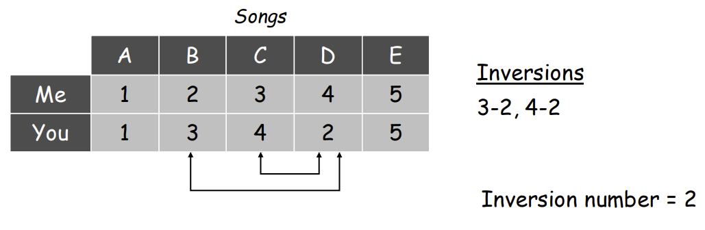
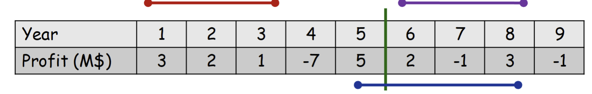
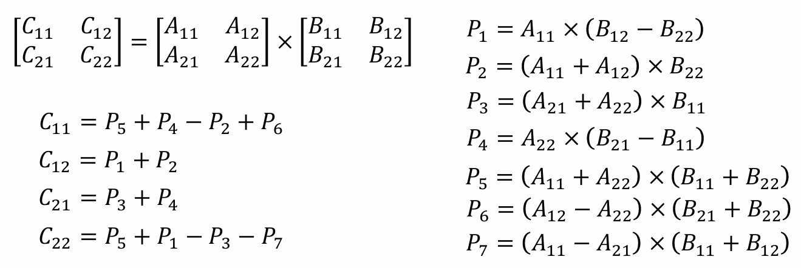

---
aliases:
  - COMP3711 index
  - COMP3711
  - Design and Analysis of algorithms
  - Algorithms
tags:
  - flashcard/active/algo
  - COMP3711
---

# COMP3711
- All the following will be typed by hand after I read and progress through:
  - lecture notes of HKUST COMP3711
  - HKUST COMP3711H materials prepared by professor Arya. 
  - https://amir.goharshady.com/teaching/honors-algorithms 
  - https://amir.goharshady.com/teaching/honors-discrete-math
# Lecture 1
## COMP3711H
- the following content is from COMP3711H lectures note sectioned "lecture 1"
- ## Overview
  - something discussed earlier in COMP2711:
    - [asymptotics](../../../notes/asymptotic_analysis.md)
    - summations
    - recurrences
    - sorting
    - basic graph algorithms (?)
  - algorithm design techniques:
    - [greedy](../../../notes/greedy-algorithms.md)
    - [dynamic programming](../../../notes/dp.md)
    -  augmentation-based methods (for network flow problems) (?)
  - first half of the course talks about problems that can be solved efficiently
  - second half would be on intractability and NP-hard problems (?)
    - basically problems that no efficient solutions were found
  - finally, discuss methods to approximately NP-hard problems

- ## [Algorithm](../../../notes/algorithm.md)
  - what is an [algorithm](../../../notes/algorithm.md):
    - algorithm refers to a certain sequence computational steps, steps that be programmed, that receives some **inputs** and produces the corresponding desired **outputs** of the problem. 
- ## Design
  - why do we want to design algorithms and study the art of doing so:
    - To develop efficient algorithms. Here are some common techniques includes:
      - [divide-and-conquer](../../../notes/divide-and-conquer.md)
      - [greedy](../../../notes/greedy-algorithms.md) 
      - [dynamic programming](../../../notes/dp.md)
    - To solve tricky combinatorics problem
  - ### some issues
    - we need to be concerned about the _correctness_ and _efficiency_ of algorithms 
      - for the correctness. Equip and master mathematical proofs e.g. induction, strong induction, proof by contraction
      - be comfortable with mathematics
- ## Analysis
  - Complexity analysis
    - [running time analysis](../../../notes/runtime_analysis.md):
      - $T(n)$ : $n$ being the _input size_ here. The worst-case number of steps to count **primitive** steps: (adding two numbers, multiplying two numbers, comparing two numbers etc.)
    - [Asymptotic analysis](../../../notes/asymptotic_analysis.md):
      - to identify promising solutions 

- ## Some mental notes on describing algorithm in COMP3711 
  - present the algorithm
    - provide unambigious description to the algorithm
    - minimize obvious technical details
    - remember it will be read by human. Make things stupidly clear
  - Prove its correctnenss
    - give a high-level view and justification of the algorithm. 
    - after that, talks about some tricky elements of the algorithm
  - Analyze its efficiency
    - give a worst-case analysis of the algorithm (the running time analysis) 
    - might have solve some recurrences/summation

## COMP3711
- the following content is from COMP3711 lecture notes.
- ## Mechanics (asymptotics stuff)
  - [asymptotic analysis](../../../notes/asymptotic_analysis.md)  

# Lecture 2
- the following, and the rest would all follow COMP3711 lecture notes. With potentially additional knowledge from my reading of COMP3711H lecture notes or videos if I have time
- ## Some sorting algorithms
  - [selection sort](../../../notes/selection_sort.md), it talks about:
    - the idea
    - pseudo-code
    - correctness proof
    - [running time analysis](../../../notes/runtime_analysis.md)
  - [insertion sort](../../../notes/insertion_sort.md)
    - the idea
    - pseudo-code
    - [running time analysis](../../../notes/runtime_analysis.md)
  - wild-guess sort (one page) (?) (uhh shouldn't be too important)

- ## Algorithm comparison
  - how to compare two algorithms:
    - what to measure:
      - **memory** (space complexity) (?)
      - total space (?)
      - working space (excluding the space for holding inputs) (?)
      - [running time](../../../notes/runtime_analysis.md)
    - how to measure?
      - **Empirical**: depends on actual implementations, computer hardware, etc. 
      - <u>**Analytical**</u>: depends only on the algorithm, focus of COMP3711, which is basically [asymptotic analysis](../../../notes/runtime_analysis.md)
- ## Analysis
  - best-case running time
    - an instance for a given size $n$ that results in the fastest possible running time 
    - Example: an already sorted array for [insertion sort](../../../notes/insertion_sort.md)
    - most of the time useless and not the focus of COMP3711
  - worst-case analysis
    - an instance for a given size $n$ that results in the slowest possible running time
    - Example: an inversely sortedd array for [insertion sort](../../../notes/insertion_sort.md)
  - Average case analysis
    - Running time averaged over all possible instances for the given size, assuming some probability distribution on the instances.
    - Example: for [insertion sort](../../../notes/insertion_sort.md), assuming that each of the $n!$ permutations of the $n$ numbers is equally likely
    - rigorous analysis can be complicated 
- ## More on worst-case analysis
  - The algorithm's worst case running time is $O(f(n))$  means:
    - On all inputs of (large) size $n$, the [running time](../../../notes/runtime_analysis.md) of the algorithm is $\leq c \cdot f(n)$
>   - It implies:
>     1. No need to find the worst input. Because you should have already proven the "ceiling" is $c \cdot f(n)$ mathematically, which means the total number of primitive steps that the algorithm run in its worst-case should not be larger than $c \cdot f(n)$
>     2. No need to consider input size smaller than constant $n_0$ in the formal definition of [Big-O](../../../notes/big_O.md). Because according to the formal definition of [Big-O](../../../notes/big_O.md), the analysis might not apply to input size smaller or equal to $n_0$. Which actually doesn't matter as [asymptotic analysis](../../../notes/asymptotic_analysis.md) focuses on the algorithm often when input size is very large or even approaches infinity 
  - The algorithm's worst case running time is $\Omega(f(n))$
    - There exists at least one input of (large) size $n$ for which the running time of the algorithm is $\geq c \cdot f(n)$
>    - Mainly used to show that the [big-O](../../../notes/big_O.md) analysis is [tight](../../../notes/big_Theta.md) (i.e., the best possible upper bound)
>    - often not required

  - Example:  [insertion sort](../../../notes/insertion_sort.md)
    - On all inputs and worst input (in revser order), it requires $\frac{n(n - 1)}{2}$ time
    - Insertion sort runs in $O(n^2)$ time (upper bound) (worst-case)
    - Insertion sort runs in $\Omega(n^2)$ time (upper bound) (worst-case)
    - Therefore, Insertion sort runs in $\Theta(n^2)$ time 
    - Takeaway: once the [big-O](../../../notes/big_O.md) and [big-Omega](../../../notes/big_Omega.md) is the same. The bound is tight and we can conclude the corresponding function also applies to [big-Theta](../../../notes/big_Theta.md)
- ## When algorithms has the same theoretical running time
  - how to distinnguish them:
    - closer examination of hidden constants
    - analysis of typical expected inputs 
    - other facts such as cache efficiency, parallelization, etc.
    - Empirical comparison 
  - theorical analysis provides first guidelines
    - useful when you do not know what input to expect
- ## pseudo-code 
  - talks about the importance of writing pseudo-code
    - makes the main idea more clear
  - how to write pseudo-code
    - use standard keywords like: (if/then/else, while, for, repeat/until, return) 
    - and notations like (<- for assigning variables, Array[index], func(arg)), etc.
    - Indent consistently, may also use `{}` for clarity
    - use standard maths notation instead of programming language 
      - `i = i + 1` instead of `i++`
      - $x \cdot y$ and $x \mod y$ instead of `x * y and x % y`
      - $\sqrt{x} and a^b$ instead of `sqrt(x)` and `power(a,b)`
    - use data structure as black boxes. If data structure is new, define its functionality first
    - Use standard/learned algorithm e.g. sorting as black boxes
      - e.g. sometimes just write "sort `A` in ascending order"
    - Use function to decompose complex algorithms
    - Use plain or natural language when it is clearer and simpler 
      - (e.g., if `A` is an array, you may write “`x` ← the maximum element in `A`”).
- ## At the end of lecture note 2
  - ### [Exercise 2](../COMP3711/problems/COMP3711_problems/lecture1_exercise2.md)
  - ### [Exercise 3](../COMP3711/problems/COMP3711_problems/lecture1_exercise3.md)

# Lecture 3 [DC (Divide and Conquer)](../../../notes/divide-and-conquer.md)
- Main idea: Solve a problem of size $n$ by breaking down the problem into smaller problem of size less than $n$
  - then solve the smaller problem recursively 
    - finally combine their solutions to solve the original problem which is large
- Example: [binary search](../../../notes/binary_search.md)

- More complex example: [Tower of Hanoi](../../../notes/tower_of_hanoi.md)
- [merge sort](../../../notes/merge_sort.md)

# Lecture 4 (Inversion number)
## revision
- ### divide and conquer
  - break up problem into several parts
  - Solve each part recursively
  - combine solutions to sub-problems into overall solution 
- ### Most common pattern 
  - Break up problem of size n into two equal parts of size $\frac{n}{2}$
  - Solve two parts recursively 
  - Combine two solutions into overall solution
- ### Techniques needed
  - Algorithm uses recursion
  - Analysis uses recurrence
- ### Previous example
  - [binary search](../../../notes/binary_search.md)
  - [tower of hanoi](../../../notes/tower_of_hanoi.md)
  - [merge sort](../../../notes/merge_sort.md)

## revision of merge sort
- ### merge sort:
  - divide an array into two halves
  - recursively sort each half
  - merge two halves to make sorted whole

## Inversion number
- ### definition
  - give array $A[1..n]$, two elements $A[i]$ and $A[j]$ are inverted if $i < j$ but $A[i] > A[j]$  
- ### it is a useful measure for
  - How "sorted" an array is
  - The similarity between two rankings (?)
  - 
  - Q: What is the maximum number of inversions if both arrays have size $n$?
  - Answer: ${n \choose 2}$

## Relation to [insertion sort](../../../notes/insertion_sort.md)
- for a single array, the inversion number indicates how far is the array from being sorted
- **Theorem:** The number of sort used by insertion sort = inversion number
- **proof:** by induction on the size $n$ of the array
  - assume theorem is correct for an array of size $n - 1$
  - this says that the total number of swaps performed when insertion sorting $A[1..n-1]$ is the inversion number of $A[1..n-1]$
  - let $x = A[n]$, remaining work by the algorithm is:
    - number of swaps performed when comparing $x$ to items in $A[1..n - 1]$
    - which equals to: number of items $j < n$ such that $A[j] > A[n]$
    - which equals to: number of inversions which $x$ participates
  - adding these new inversions to the ones in $A[1..n - 1]$ gives the full inversion number of $A[1..n]$
- Q: How can we compute the inversion numbers:
  - Check all $\Theta({n^{2}})$ pairs
  - Run insertion sort and count the number of swaps - Also $\Theta({n^{2}})$ time
## Counting Inversions: Divide-and-Conquer
- ### divide-and-conquer
  - divide: divide array into two halves
  - conquer: recursively count inversions in each half
  - **combine:** count inversions in where $a_i$ and $a_j$ are in different halves, and return sum of three quantities.
- ### Simple combine step:
  - Assume array is split into left half and right half and each is already sorted
  - How can we count number of inversions where $a_i$ and $a_j$ are in different halves:
    - Example:
      - $L[i] = 3, 7, 10, 14, 18, 19$ 
      - $R[j] = 2, 11, 16, 17, 23, 25$ 
      - Number of inversions of each items in $R[j]$ to $L[i]$ $= m - l - i + 2$
      - idea is we have $m - l + 1$ elements on the left half and thus $(m - l + 1) - i + 1$ number of inversion count.
        ````cpp
        Merge-and-count(A, l, m, r):
          Create two arrays L and R
          L <- A[l..m], R <- A[m + 1 .. r]
          Append ∞ to end of both arrays
          i <- 1, j <- 1
          c <- 0

          for k <- l to r:
            if L[i] <= R[j]:
              A[k] = L[i]
              i <- i + 1
            else
              A[k] = R[j]
              j <- j + 1
              c <- c + m - l - i + 2
          
          return c

        Sort-and-count(A, l, r):
          if l >= r:
            return 0
          m <- floor((l + r) / 2)
          c1 <- Sort-and-count(A, l, m)
          c2 <- Sort-and-count(A, m + 1, r)
          c3 <- Merge-and-count(A, l, m, r)
        return c1 + c2 + c3
        ````
- ### D&C Observation on problem size and number of problems:
  - **Most common pattern:**
    - Break up problem of size $n$ into two equal parts to get problem size of $\frac{n}{2}$
    - Solve two parts recursively and combine two solutions into overall solution
  -  **Each time we break up a problem in 2 parts of size $\frac{n}{2}$, we double the number of subproblems and we halve the size of each subproblem**
     - level 0: we have original problem of size $n$
     - level 1: we break 1 time and we have $2 = 2^1$ problems of size $\frac{n}{2}$ 
     - level 2: we break 2 times and we have $4 = 2^2$ problems of size $\frac{n}{2^2}$
     - level 3: we break 3 times and we have $8 = 2^3$ problems of size $\frac{n}{2^3}$
     - level $i$: we break $i$ times and we have $2^i$ problems of size $\frac{n}{2^i}$
  - **When to stop breaking up**
    - when we cannot break up anymore; usually when the problem size becomes 1 i.e. when we reach level $i$ such that:
      - $\frac{n}{2^i} = 1 \implies n = 2^i \implies i = \log_2 n$
      - the number of subproblems at (bottom) level $\log n$ is $2^i = 2^{\log_2 n} = n$
  - **Other patterns:**
    - Break up problem of size $n$ into $p$ parts to get problem size of $\frac{n}{q}$
    - Solve parts recursively and combine solutions into overall solution.
    - level 0: we have original problem of size $n$
    - level 1: we break 1 time and we have $p$ problems of size $\frac{n}{q}$ 
    - level 2: we break 2 times and we have $p^2$ problems of size $\frac{n}{q^2}$
    - level 3: we break 3 times and we have $p^3$ problems of size $\frac{n}{q^3}$
    - level $i$: we break $i$ times and we have $p^i$ problems of size $\frac{n}{p^i}$
  - **When to stop breaking up**
    - when we cannot break up anymore; usually when the problem size becomes 1 i.e. when we reach level $i$ such that:
      - $\frac{n}{q^i} = 1 \implies n = q^i \implies i = \log_q n$
      - the number of subproblems at (bottom) level $\log n$ is $p^i = p^{\log_q n}$
  - **More patterns**
    - Break up problems of size $n$ into $p \geq 2$ parts of size $n -q$
    - Example: for the [towers of hanoi](../../../notes/tower_of_hanoi.md) problem, $p = 2$, and $q = 1$: i.e., we break the problem in two problems of size $n - 1$
    - Assume that we break the problem in $p$ problems of size $n - 1$
    - level 1: we break 1 time and we have $p$ problems of size $n - 1$
    - level 2: we break 2 time and we have $p^2$ problems of size $n - 2$
    - level 3: we break 1 time and we have $p^3$ problems of size $n - 3$
    - level $i$: we break 1 time and we have $p^i$ problems of size $n - i$
    - If we stop when the problem size becomes 1, then:
      - $n - i = 1 \implies i = n - 1$
    - The number of problems at the bottom level $n - 1$ is $p^i = p^{n - 1}$ 
    - Assuming $T(1) = 1$, the work $p^{n - 1}$ for the bottom level is exponential. Therefore, the total running time, which includes all levels, is also exponential.
# Lecture 5 (maximum subarray and related problems)
- ## The maximum subarray problem
  - **Input:** Profit history of a company. Money earned/lost each year

  |year |1|2|3|4|5|6|7|8|9|
  |-----|-|-|-|-|-|-|-|-|-|
  |Profit (M$)|3|2|1|-7|5|2|-1|3|-1|
  - **Problem:** find the span of years the company has earned the most
  - **Answer:** year 5 - 8, 9M$

  - **formal definition:**
    - **input:** an array of numbers $A[1..n]$, both positive and negative
    - **output:** find the maximum $V(i, j)$, where $V(i, j) = \sum_{k = i}^{j}{A[k]}$
- ## Brute force algorithm
  - **idea:** calculate the value of $V(i,j)$ for each pair $i \leq j$ and return the maximum value.
    ````cpp
    max <- 0
    for i <- 1 to n:
      for j <- i to n:
        sum <- 0
        for k <- i to j:
          sum <- sum + A[j]
        if sum > max:
          max = sum:
    return max
    ````
  - to measure the running time, we count the number of additions
  - **running time:** $\Theta(n^3)$
  - _intuition:_ calculating value of $\Theta(n^2)$ arrays, each one, on average, $\Theta(n/2)$ long (?)
- ## Data-reuse algorithm
  - **idea:**
    - don't need to calculate $V(i, j)$ from scracth
    - exploit the fact that: $V(i, j) = V(i, j - 1) + A[j]$
      ````cpp
      max <- 0
      for i <- 1 to n:
        sum <- 0
        for j <- i to n:
          sum <- sum + A[j]
          if sum > max:
            max = sum:
      return max
      ````
    - **running time:** $\Theta(n^2)$
    - _intuition:_ fix starting point $i$. Calculating $V(i, j)$ from $V(i, j - 1)$ requires only $\Theta(1)$ time $\implies \Theta(n^2)$ total (?)
- ## A divide and conquer algorithm
  - **idea:**
    - cut the array into **two halves**
    - all aubsarrays can be classified into three cases:
      - Case 1: entirely in the first half
      - Case 2: entirely in the second half
      - Case 3: some in the first half, some in the second half 
      - 
    - largest of 3 cases is the final solution 
    - The optimal solution of case 1 and case 2 can be found recursively
    - need to consider case 3
    - Compare with merge sort:
      - if we can solve case 3 with $O(n)$ time
      - the whole algorithm will run in $O(n\log n)$ time
- ## Solving case 3
  - **idea:**
    - any case 3 subarray $V(i, j)$ can be divided into two parts
      - $A[i..m]$
      - $A[m + 1..j]$
      - The optimal case 3 subarray (crosses the cut) must contains $A[m]$ and $A[m + 1]$
        - otherwise, it would fall under cases 1 or 2
      - just need to maximize each of them separtely
  - **to maximize $A[i..m]$ and $A[m + 1..j]$**
    - let _`i'`_ and _`j'`_ be the indices that maximize the values of $A[i..m]$ and $A[m + 1, j]$:
    - _`i'`_ and _`j'`_ can be found using separate linear scans to left and right of $m$
      ````
      -> A[i'..j'] has the largest value of all subarrays that cross m
      ````
- ## the complete D&C algorithm:
  ````cpp
  max_array(A, l, r):
    // already broken down to only 1 element
    if (l >= r):
      return A[l]
    m <- floor((l + r) / 2)
    M1 <- max_array(A, l, m)
    M2 <- max_array(A, m + 1, r)

    Lm <- -∞, Rm <- -∞

    sum <- 0
    for k <- m down to l:
      sum <- sum + A[k]
      if (sum > Lm):
        Lm = sum:
    
    sum <- 0
    for k <- m + 1 to r:
      sum <- sum + A[k]
      if (sum > Rm):
        Rm = sum:
    
    M3 <- Lm + Rm
    return max(M1, M2, M3)
  ````

- ## linear algorithm for maximum subbarray problem
  - **Kadane’s algorithm:** based on the principles of Dynamic Programming
  - add a variable $V$ such that $V$ saves the sum of elements from first index of the array
    - it resets and restart at index $i$ when it becomes negative
    - we detects it being negative using $V + A[i] < A[i]$
    - since there's a possibility where $V$ resets after reaching its peak
      - we use another variable $V_{max}$ to record the peak
  - code:
    ````cpp
    V_max <- -∞, V <- 0, start <- 1, end <- 1
    for i <- 1 to n:
      V <- V + A[i]
      if V < A[i]:
        V <- A[i]
        temp <- i
      if V > V_max:
        V_max <- V
        start <- temp
        end <- i
    return V_max, start, end
    ````

## Maximizing Stock Profits
- You have found a newspaper from the future that tells you the price of a stock over a period of $n$ days in the next year. The presents to you as $p[1..n]$ where $p[i]$ represents the price of the stock on day $i$ 
- Design a $O(n\log n)$ algorithm to make as much money as possible, i.e. find a pair of $i, j$ with $1 \leq i \leq j \leq n$ such that $p[j] - p[i]$ is maximized over all possible such pairs
- Note: you are only allowed to buy the stock once and sell it later
  - you are not allowed to make multiple purchases and sales over time
- If there is no way to make money.
  - i.e. $p[j] - p[i] = 0$ for all pairs of $i, j$ that $1 \leq 1 \leq j \leq n$
  - the algorithm should return 0
- I feel like this problem is very similar to maximum subarray problem.
  - It is just that now we are not summing the elements in a certain interval
  - It is that we need to find the smallest starting element and biggest ending element
- ## code
  - a few mental notes:
  - although I can most certainly copy the maximum subarray problems and change a few things. 
  - It is better to not do so:
    - benefit the future
    - you write them from scratch yourself gains you experience in writing the algorithm 
    - make things faster and easier in the future
      ````cpp
      max_profit(A, l, r):
        // base case
        // broken down to only 1 element
        if (l = r)
          // buying and selling the element on the same day
          // gains nothing, so 0
          return 0 
        
        m <- floor((l + r) / 2)

        // divides the problem into 2 smaller subproblems
        // i.e. the profit entirely on either 2 halves
        P1 = max_profit(A, l, m)
        P2 = max_profit(A, m + 1, r)

        L_min = ∞, R_max = -∞
        // case 3, the most profitable interval crosses the cut
        // O(n)-time complexity 

        // searching minimum value from the rightmost of the left portion to the leftmost of that portion
        for k <- m down to l:
          if A[k] < L_min:
            L_min = A[k]

        // searching maximum value from the leftmost of the right portion to the rightmost of that portion
        for k <- m + 1 to r:
          if A[k] > R_max:
            R_max = A[k]
        P3 = R_max - L_min

        return max(P1, P2, P3)

      ````
# Lecture 6 
- ## Binary Multiplication: Break into smaller problems
  - Goal. Given two $n$-bit integers $a$ and $b$, computer $a \cdot b$.
    - Example: $163 \times 97$ i.e. $10100011 \times 01100001$ ($n = 8$)
  - Rewrite numbers. $a = 2^{n/2}a_1 + a_0$, $b = 2^{n/2}b_1 + b_0$
  - $a_1 = 1010$, $a_0 = 0011$
  - $b_1 = 0110$, $b_0 = 0001$
  - Note: $2^{n/2}$ can be thought of having $n/2$ least significant bits that are equal to $0$.
  - The rewritten numbers: 
  $$\begin{aligned}
  a \cdot b &= (2^{n/2}a_1 + a_0) \cdot (2^{n/2}b_1 + b_0) \\
  &= 2^{n}a_1b_1 + 2^{n/2}(a_1b_0 + a_0b_1) + a_0b_0
  \end{aligned}
  $$

  - So basically the observation is that a multiplication by $2^k$ would take a $O(k)$ time to just left shit the $k$ bits needed 
    - Example: $12 = 00001100.$ $ 12 \times 2^3 = 96$ is the same as left shitfing $00001100$ by 3 bits
    - $00001100 \ll 3$
    - we use $\ll$ to denote left shifting
- ## Binary multiplication: (motivation of D&C)
  - instead of multipliying two $n$-bit numbers directly with long multiplication:
    - Rewrite the numbers: $a = 2^{n/2}a_1 + a_0$, $b = 2^{n/2}b_1 + b_0$
      - $a_1 = 1010$, $a_0 = 0011$
      - $b_1 = 0110$, $b_0 = 0001$
    - The product to be computed becomes:
      - $a \cdot b = 2^{n}a_1b_1 + 2^{n/2}(a_1b_0 + a_0b_1) + a_0b_0$
    - The new computation now requires 4 products of integers, each with $n/2$ bits:
      - $a_1b_1, a_1b_0, a_0b_1, a_0b_0$
    - So this is just applying D&C to split the problems of size $n$ to 4  problems of size $n/2$
  - ### Code 
    - $A[1]$ and $B[1]$ being the least significant bit
      ````cpp
      multiply(A, B):
        n <- size of A
        m <- floor(n/2)

        U <- multiply(A[m + 1..n], B[m + 1..n]) // a1b1
        V <- multiply(A[m + 1..n], B[1..m]) // a_1b_0
        W <- multiply(A[1..m], B[m + 1..n]) // a_0b_1
        Z <- multiply(A[1..m], B[1..m]) // a_0b_0

        create an array M of size 2n
        M[1..2n] <- 0
        M[2m + 1..] = M[2m + 1..] + U
        M[m + 1..] = M[m + 1..] + V + W 
        M[1..m] = M[1..m] + Z 

        return M
      ````


- ## Karatsuba Multiplication
  - since $a \cdot b = 2^{n}a_1b_1 + 2^{n/2}(a_1b_0 + a_0b_1) + a_0b_0$
  - observation: we don't have to compute $(a_1b_0 + a_0b_1)$ by first computing its individual products: $a_1b_0$ and $a_0b_1$. 
  - We can compute that sum by doing:
    - $a_1b_0 + a_0b_1 = (a_1 + a_0)(b_1 + b_0) - a_1b_1 - a_0b_0$
    - where $a_1b_1 + a_0b_0$ have already been computed before
    - calculating $a \cdot b$ now only requires 3 multiplications subproblems of size $n/2$:
      - $(a_1 + a_0)(b_1 + b_0)$
      - $a_1b_1$
      - $a_0b_0$
    - ### Code
    ````cpp
    multiply(A, B):
      n <- size of A

      if (n = 1) return A[1] * B[1]

      m <- floor(n/2)

      a0 = A[1..m], a1 = A[m + 1..n]
      b0 = A[1..m], b1 = A[m + 1..n]

      create a new array R

      a0b0 = multiply(a0, b0)
      a1b1 = multiply(a1, b1)

      R[1..2n] <- 0

      R[1..n] = a0b0
      R[m + 1..] = R[m + 1..] + multiply(a_0 + a_1, b_0 + b_1) - a1b1 - a0b0
      R[2m + 1..] = R[2m + 1..] + a1b1

      return R
    ````

- ## matrix multiplication
  - Given two $n$-by-$n$ matrices $A$ and $B$, computer $C = AB$
  - Bruteforce: $\Theta(n^3)$ time
  - fundamental question: Can we improve upon bruteforcing?
- ### first attempt:
  - Divide and conquer:
    - Divide: partition $A$ and $B$ into $\frac 1 2 n$-by$\frac 1 2 n$  blocks
    - Conquer: multiply 8 $\frac 1 2 n$-by$\frac 1 2 n$ submatrices recursively
    - Combine: add appropriate products using 4 matrix additions
    - $T(n) = 8T(n/2) + O(n^2)$
- ### Strassen’s Matrix Multiplication Algorithm
  - Key idea.  multiply 2-by-2 block matrices with only 7 multiplications. Intsead of 8
  - 
  - 7 multiplications of $\frac 1 2 n$-by$\frac 1 2 n$ submatrices
  - $\Theta(n^2)$ additions and subtractions

# Lecture 7 (Master theorem)
- ## The master theorem
  - what is it:
    - a tool for directly (without expansion or recursion tree) solving recurrences of form:
    - $T(n) = aT(n/b) + f(n)$
      - $a \geq 1$ and $b > 1$ are constants 
      - $f(n)$ is a (asymptotically) positive polynomial function
      - Initial conditions $T(1), T(2), ... , T(k)$ for some $k$ don't contribute to asymptotic growth
      - $n/b$ could be either $\lfloor{n/b}\rfloor$ or $\lceil{n/b}\rceil$
- ## Visualization for master theorem:
  - $T(n) = aT(n/b) + f(n)$
    - $a \geq 1, b > 1$ are constants, $c = \log_b a$ 

|Level|Number of problem|Work/problem|Work/level|
|-----|-----------------|------------|----------|
|$0$|$1$|$f(n)$|$f(n)$|
|$1$|$a$|$f(n/b)$|$a \cdot f(n/b)$|
|$2$|$a^2$|$f(n/b^2)$|$a^2 \cdot f(n/b^2)$|
|$i$|$a^i$|$f(n/b^i)$|$a^i \cdot f(n/b^i)$|
|$\log_b n$|$a^{\log_b n} = n^{\log_b a} = n^c$|$1$|$n^c$|

- ## The master theorem (for equalities)
  - $T(n) = aT(n/b) + f(n), \quad c = \log_b a$
    - if $f(n) = O(n^{c - \epsilon})$ for some $\epsilon > 0 \implies T(n) = \Theta(n^c)$  (?)
      - intuition: the work increases as we go down the levels. Bottom level dominates the total cost. (?)
    - if $f(n) = \Theta(n^{c}) \implies T(n) = \Theta(n^c \log n)$  (?)
      - intuition: the work remains the same as we go down the level. All levels contribute equally to the total cost (?)
    - if $f(n) = \Omega(n^{c + \epsilon})$ for some $\epsilon > 0 \implies T(n) = \Theta(f(n))$  (?)
      - There is an additional condition that we would ignore for this class
      - intuition: the work decreases as we go down the levels. Top level dominates the total cost. (?)
- ## The master theorem (for inequalities)
  - $T(n) \leq aT(n/b) + f(n), \quad c = \log_b{a}$
    - if $f(n) = O(n^{c - \epsilon})$ for some $\epsilon > 0 \implies T(n) = O(n^{c})$
    - if $f(n) = O(n^c) \implies T(n) = O(n^{c}\log{n})$
    - if $f(n) = \Omega(n^{c + \epsilon})$ for some $\epsilon > 0 \implies T(n) = O(f(n))$
- ## Master theorem when $f(n) = \Theta(n)$
  - $T(n) \leq aT(n/b) + \Theta(n), \quad c = \log_b{a}$
    - if $c > 1$, then $T(n) = \Theta(n^c)$
      - example 1:  if $T(n) = 4T(n/2) + \Theta(n)$ then $T(n) = \Theta(n^2)$
      - example 2:  if $T(n) = 3T(n/2) + \Theta(n)$ then $T(n) = \Theta(n^{\log_2{3}})$
    - if $c = 1$, then $T(n) = \Theta(n\log{n})$
      - example:  if $T(n) = 2T(n/2) + \Theta(n)$ then $T(n) = \Theta(n\log{n})$
    - if $c < 1$, then $T(n) = \Theta(n)$
      - example:  if $T(n) = T(n/2) + \Theta(n)$ then $T(n) = \Theta(n)$
- ## More on master theorem:
  - There are more variations...
    - if $T(n) = T(3n/4) + T(n/5) + n$ then 
      - $T(n) = \Theta(n)$
    - more generally, given constants $a_i > 0$ with $\sum_{i}{a_i} < 1$:
      - if $T(n) = n + \sum_{i}{T(a_i \cdot n)}$ then 
        - $T(n) = \Theta(n)$ 

- ## Master theorem when $f(n) = O(n)$
  - $T(n) \leq aT(n/b) + kn, \quad a \geq 1 \quad and \quad b > 1 \text{ are constants,} \quad c = \log_a{b}$ 
  - if $c > 1,$ then $T(n) = O(n^c)$
  - if $c = 1,$ then $T(n) = O(n\log{n})$
  - if $c < 1,$ then $T(n) = O(n)$
- ## Proof of Inequality Master Theorem when $f(n) = O(n)$
  - $T(n) \leq aT(n/b) + kn, \quad a \geq 1 \quad and \quad b > 1 \text{ are constants,} \quad c = \log_a{b}$ 

|Level|Number of problem|Work/problem|Work/level|
|-----|-----------------|------------|----------|
|$0$|$1$|$kn$|$kn$|
|$1$|$a$|$kn/b$|$kn(a/b)$|
|$2$|$a^2$|$kn/b^2$|$kn(a/b)^2$|
|$i$|$a^i$|$kn/b^i$|$kn(a/b)^i$|
|$\log_b n$|$a^{\log_b n} = n^{\log_b a} = n^c$|$1$|$n^c$|

  - The total running time is **$n^c$ on the bottom level**, plus $kn(1 + (a/b) + (a/b)^2 + (a/b)^3 + ... + (a/b)^{\log_b{n} - 1}$ **for the rest**
  - ### Case 1: $(a > b, c > 1)$
$$
T(n) \leq n^{c} + kn\sum_{j = 0}^{\log_b{n} - 1}{(\frac{a}{b})^{j}}
$$
  - if $a > b$, it is an increasing geometric series.
$$
\begin{aligned}
\sum_{j = 0}^{\log_b{n} - 1}{(\frac{a}{b})^{j}} &= \frac{(\frac{a}{b})^{\log_b{n}} - 1}{\frac{a}{b} - 1} \\
&\leq \frac{\frac{a^{\log_b{n}}}{b^{\log_b{n}}}}{\frac{a}{b} - 1} \\
&\leq \frac{\frac{n^{\log_b{a}}}{n}}{\frac{a}{b} - 1} \\
&\leq \frac{\frac{n^{c}}{n}}{\frac{a}{b} - 1} \\
&\leq \frac{n^{c - 1}}{\frac{a}{b} - 1} \\
\end{aligned}
$$
  - hence, for $a > b \quad (c > 1)$:
$$
T(n) = O(n^{c} + kn\frac{n^{c - 1}}{\frac{a}{b} - 1}) = O(n^{c})
$$
  - the bottom level dominates cost. 
  - Example: if $T(n) \leq 3T(n/2) + n,\quad a = 3, b = 2,$ and $T(n) = O(n^{\log_2{3}})$ 

  - ### Case 2: $(a = b, c = 1)$
$$
T(n) \leq n^{c} + kn\sum_{j = 0}^{\log_b{n} - 1}{(\frac{a}{b})^{j}}
$$
  - if $a = b$, 
$$
\sum_{j = 0}^{\log_b{n} - 1}{(\frac{a}{b})^{j}} = \log_b{n}
$$
  - hence, for $a = b \quad (c = 1)$:
$$
T(n) = O(n^{c} + kn\log_b{n}) = O(n\log{n})
$$
  - each level contributes cost $kn$
  - Example: if $T(n) \leq 2T(n/2) + n,\quad a = 2, b = 2,$ and $T(n) = O(n\log{n})$ 
  - Here is the visualization of **case 2 (a = b)**:

|Level|Number of problem|Work/problem|Work/level|
|-----|-----------------|------------|----------|
|$0$|$1$|$kn$|$kn$|
|$1$|$a$|$kn/a$|$kn$|
|$2$|$a^2$|$kn/a^2$|$kn$|
|$i$|$a^i$|$kn/a^i$|$kn$|
|$\log_b n$|$a^{\log_a n} = n^{\log_a a} = n$|$1$|$n$|

  - ### Case 3: $(a < b, c < 1)$
$$
T(n) \leq n^{c} + kn\sum_{j = 0}^{\log_b{n} - 1}{(\frac{a}{b})^{j}}
$$

  - if $a < b$, it is a decreasing geometric series  
 
$$
\sum_{j = 0}^{\log_b{n} - 1}{(\frac{a}{b})^{j}} = O(1)
$$

  - hence, for $a < b \quad (c < 1)$:

$$
T(n) = O(n^{c} + kn) = O(n)
$$
  - Top level (0) dominates the cost
  - Example: if $T(n) \leq 2T(n/3) + n,\quad a = 2, b = 3,$ and $T(n) = O(n)$ 