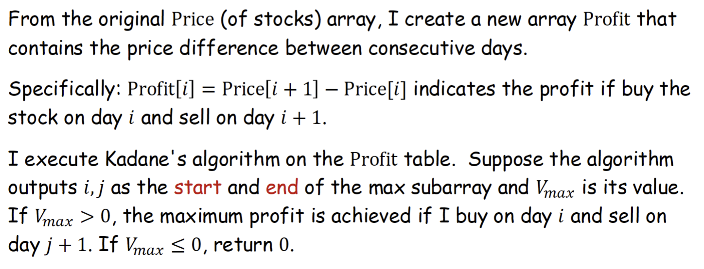

---
aliases:
  - problem
  - lecture notes 4 exercise 2
tags:
  - flashcard/active/algo
  - COMP3711
  - status/incomplete
---

# Problem
## Maximizing Stock Profits
- Describe a linear algorithm for Maximizing Stock Profits
- Hint: You can transform the problem to max subarray and use Kadane's
algorithm
- hint

|Day |1|2|3|4|5|6|7|8|9|10|11|12|
|----|-|-|-|-|-|-|-|-|-|--|--|--|
|Price|3|6|10|1|8|2|6|5|10|3|1|9|
|Profit|3|4|-9|7|-6|4|-1|5|-7|-2|8|0|

- hint:
- 

