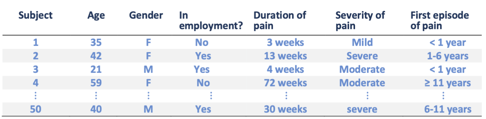
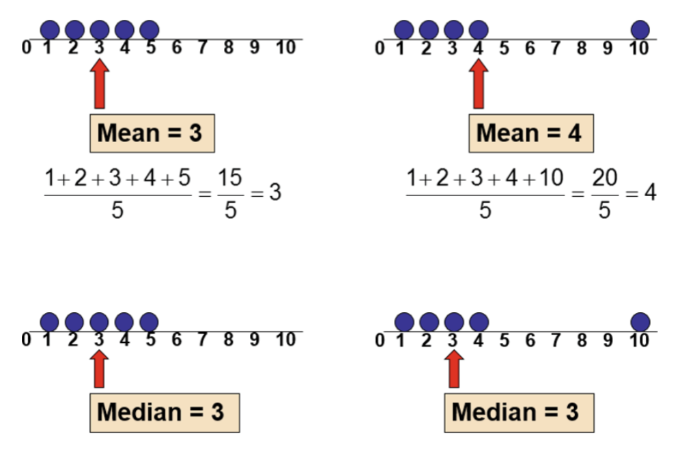
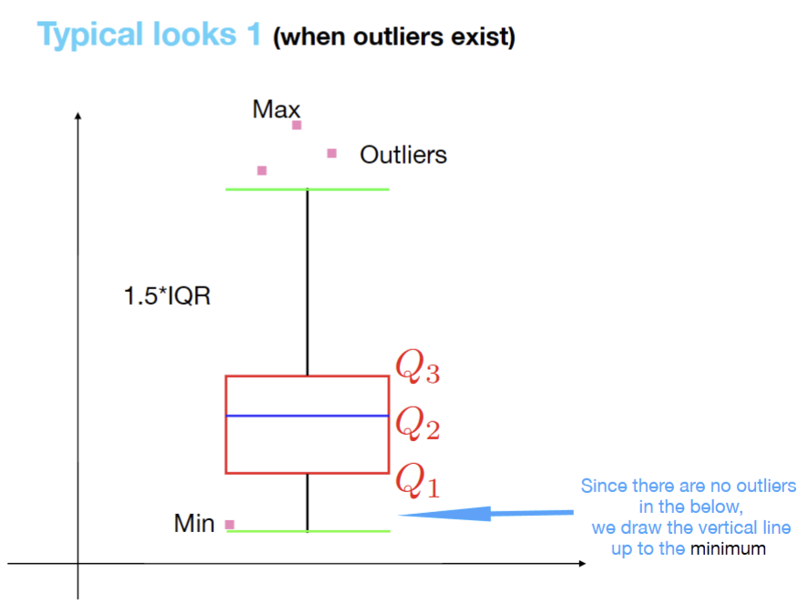
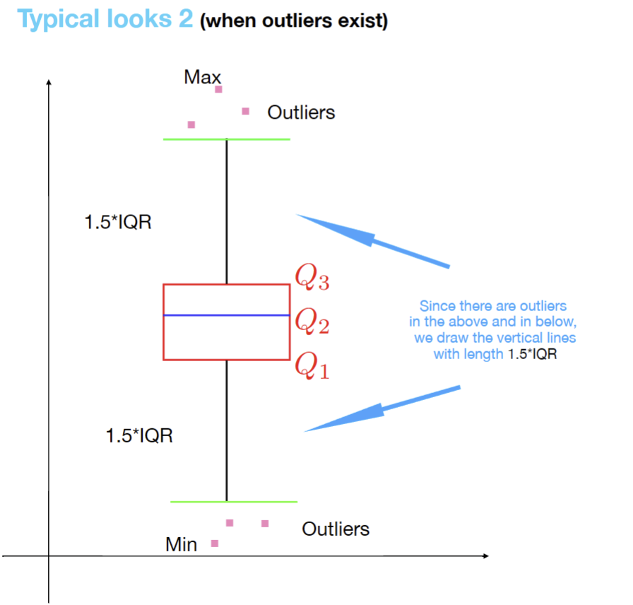
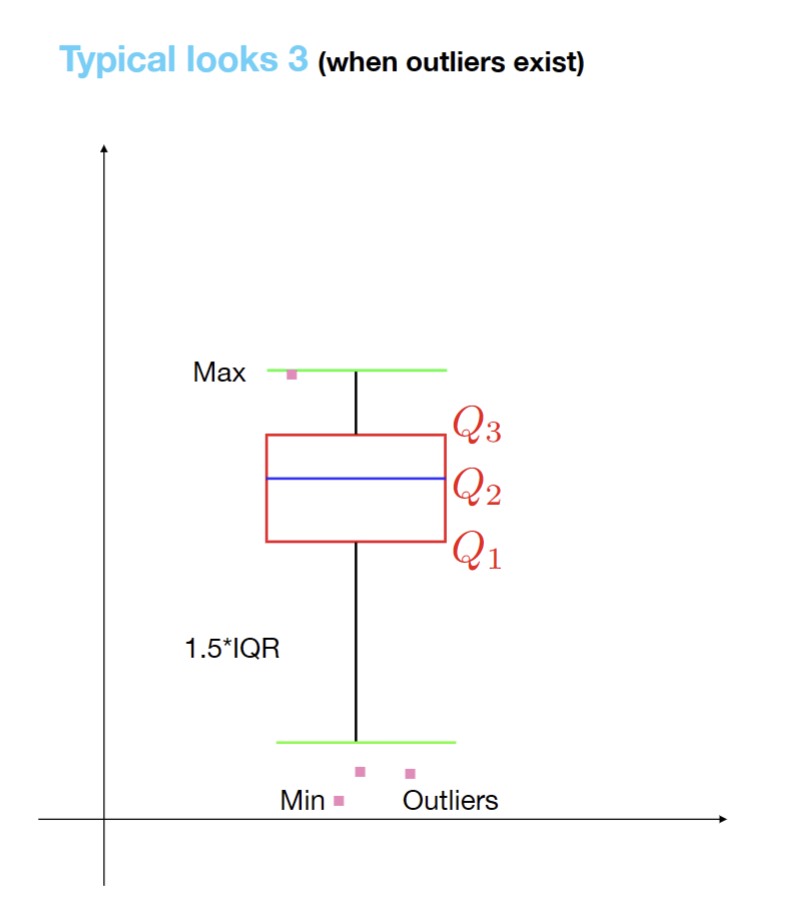

---
aliases:
  - MATH2411 index
  - MATH2411
  - Applied statistics
tags:
  - flashcard/active/stat
  - MATH2411
---

# MATH2411
- ### Basic information
  - **Course outline:**
    - basics of probability theory
      - random variables
      - probability distributions
      - expectation
    - statistical inference
      - interval estimation 
      - hypothesis testing 
      - linear regression modeling
  - **Teaching:**
    - Weekly:
      - 3 hrs lecture and 1 hr tutorial 
  - **Prerequisites:** 
    - MATH 1014 OR MATH 1018 OR MATH 1020 OR MATH 1024
  - **Exclusion:** 
    - IELM 2510, ISOM 2500, LIFS 3150
- ### Intended Learning Outcomes
  - solve basics problems in probability
  - make inference about a population by applying statistical approaches. Examples:
    - estimation and hypothesis testing
  - Formulate a statistical solution to real-data problems and interpret the results
  - Analyzing data with $R$
- ### Assessment and grading 
  - **Homework:**
    - 5 problem sets
    - assigned in canvas
    - no late submission 
  - **Exam:**
    - Midterm Exam: March 22 10:00 am–11:30 am (1.5 hr)
      - may approve **early midterm** if needed
      - or assign assign midterm marks according to final exam performance
    - Final Exam: tbd (3 hrs)
  - **Grading scheme:**
    - criterion-referencing (?)
      - Homework: 15%
      - Midterm: 25%
      - Final exam: 60%
- ### Textbook:
  - it is "Probability and Statistics for Engineers and Scientists" (9th Edition Prentice Hall) by Ronald E. Walpole, Raymond H. Myers, Sharon L. Myers and Keying Ye.
- ### Course schedule:
  - Descriptive statistics
  - Introduction to probability theory 
  - Discrete random variables and discrete probability distributions
  - Continuous random variables and Continuous probability distributions
  - Point estimation, interval estimation
  - Hypothesis testing
  - Simple linear regression 
  - \[If time permits\] Selected topics
- ### Course AI policy
  - The use of ChatGPT or other generative AI is not allowed in homework assignments and exams.


# Lecture 1
## Introduction
- ### [Statistics](../../../notes/statistics.md)
- ### Key concepts in statistics:
  - Population
    - collection of all possible objects or individual of interests 
      - too large, can't deal with
  - Sample:
    - part of the population selected for analysis
      - Smaller, can deal with
  - Parameter:
    - a numerical measures computed from the population and used to describe a characteristics of the population 
      - unknown
      - what is it called parameter?
  - Statistic
    - a numerical measures computed from the sample and used to describe a characteristics of the sample
      - can compute
- ### Example 1: tossing a biased coin
  - Population
    - tossing the coin to get a head of tail
  - Sample:
    - results over just 10 tosses
  - Parameter:
    - probability of head
  - Statistics:
    - Compute from the sample
- ### Example : (monthly family spending in Hong Kong)
  - Population
    - a collection of all families in Hong Kong
  - Sample:
    - 1000 families randomly selected
  - Parameter:
    - the average monthly family spending on food in Hong Kong
  - Statistic:
    - the average monthly family spending on food of the 1000 families selected
- ### Why draw a sample:
  - impossible or impractical to examine the entire population
  - instead examine a part of it (sampmle)
    - to find out something about the population 
  - this is called making a statistical inference regarding the population
- ### Two branches of statistics:
  - **Descriptive statistics:**
    - people do:
      - data collection
      - data presentation
      - data summarisation
    - provides summary of the data using tabular or graphical summary
      - e.g. frequency table
    - Describe data using:
      - measures of central tendency (e.g. mean)
      - measures of dispersion (e.g. standard deviation)
    - helps to identify patterns and trends in the data
    - Examples:
      - frequency table
      - histograms
      - scatter plots
  - **Inferential statistics:**
    - Statistical conclusion about a population based only on the data in a sample, using:
      - probability
      - Mathematics
      - Formulas
    - use sample data to make inferences about a large population
    - tests hypothesis of a statement and make decision
    - helps to address a scientific question
    - Examples:
      - t-tests
      - ANOVA
      - linear regression
- ### Course outline (again?!)
    1. Descriptive statistics
    2. Basic probability theory
    3. Random variables, distribution,
    special random variables
    4. Point estimation, confidence interval
    5. Hypothesis testing, p-value, t-test
    6. Two sample tests, ANOVS
    7. Linear regression


# Lecture 2
## Descriptive statistics (chapter 1)
- ### Outline
  - Graphical Summary:
    - Frequency table
    - Histogram
    - Line Chart 
    - Pie Chart
    - Boxplot
  - Numerical Summary
    - Sample Mean 
    - Sample Median 
    - Sample variance 
    - Quartile 
    - Range, IQR
    - Outlier
- ### Data
  - data definition:
    - it's a collection of:
      - facts
      - measurements 
      - other forms of information
    - it's also a collection of observations of variables:
      - samples
      - data points
      - values
    - for reference and analysis 
  - data needs to be organized and summarized by:
    - Graphical ways
    - numerical ways
  - Example:
  - 
    - each row represents measurements of a SINGLE case/patient
    - Each column refers to a characteristic of interests, called **variable**
    - each datum
      - is the value of a single variable for a single case
      - also known as **observation**
- ### Types of variables
  - **categorical**
    - Nominal
      - can't be ranked
        - e.g. dog species
        - UG majors
    - Ordinal 
      - can be ranked 
        - No. 1, 3, 8 typhoon signals
  - **Numerical**
    - Discrete
      - integer number
        - often by counting 
          - e.g. how many courses did you enroll
    - continuous
      - Real number
        - often from measurements
          - e.g. temperature
- ### Why care about types of data
  - decide how to interpret the data from the variable
    - In $R$, categorical variables are declared as **factors** and their possible values are **levels**
      ```r
      > x = c(1,2,3,4,5)
      > x
      [1] 1 2 3 4 5
      > y = as.factor(x)
      > y
      [1] 1 2 3 4 5
      Levels: 1 2 3 4 5
      ```
  - decide the appropriate statistical analysis
    - certain analyses may not be appropriate for certain data types:
      - e.g. we can't find average of categorical data
- ### data presentation (tabular and graphical summary)
  - presenting numerical data:
    - [frequency table](../../../notes/frequency_table.md)
    - histogram
    - [line chart](../../../notes/line_chart.md)
    - boxplot
  - presenting categorical data:
    - frequency table
    - pie chart
    - [bar chart (similar to historgram)](../../../notes/bar_chart.md)
- ### Data presentation (numerical)-**Center**:
  - **Sample mean and sample median**
    - suppose we have $n$ data, which is the observations in a sample. 
      - they are labeled by $x_1, x_2, x_3,..., x_n$
    - **Sample mean:**
      - the average of data
      - $\overline{x} = \frac{1}{n}\sum_{i = 1}^{n}{x_i} = \frac{x_1 + x_2 + ... + x_n}{n}$
      - sensitive to outliners
      - to prevent outliners while calculating mean, use **trimmed mean**:
        - it is computed by trimming away a certain percent of both the smallest and largest set of values in sample.
        - for example, the 10% trimmed mean $\overline{x}_{tr(10)}$ is calculated by eliminating the largest 10% and smallest 10% then compute the average.
    - **Sample median:**
      - The middle point of ordered data
      - Given that the data are $x_1 \leq x_2 \leq ... \leq x_n$ arranged in increasing order of magnitude
      - Then the sample median is:
      >$$\tilde{x} = 
      >\begin{cases}
      >x_{\frac{n + 1}{2}},\\
      >\frac{1}{2}(x_{\frac{n}{2}} + x_{\frac{n}{2} + 1}), \\
      >\end{cases}
      >$$  
      - insensitive to outliners 
    - 
- ### Data Presentation (Numerical)-**Sample variance**
  - **Sample variance and disspersion**
    - let the data values be $x_1, x_2, x_3, ..., x_n$, then 
    - **sample variance:**
      - $s^{2}_{n - 1} = \frac{1}{n - 1}\sum_{i = 1}^{n}({x_{i} - \overline{x}})$
      - it describes the dispersion and spread of data
        - why? why $s^{2}_{n - 1}$ describes dispersion? idk?
      - what $n - 1$?
    - **sample standard deviation:**
      - is the square root:
      - $s_{n - 1} = \sqrt{s^{2}_{n - 1}}$
- ### Data Presentation (Numerical)-**Quartiles and IQR**
  - how to find quartiles
    - total number is **odd:**
    >1. Sort the data from smallest to largest and mark the median
    >2. Create a new data segment 
    >     - consists of the first half of the full sorted list
    >     - includes the median of the full sorted list
    >       - as its last element in the new segment
    >     - The median of the new data segment is called:
    >       - the first quartile
    >       - aka $Q_1$
    >     - it is the 0.25 quantile
    >3. Back to the full sorted list. Create another new data segment 
    >     - consists of the second half of the full sorted list
    >     - includes the median of the full sorted list
    >       - as its first element in the new segment
    >     - The median of the new data segment is called:
    >       - the third quartile
    >       - aka $Q_3$ 
    >     - it is the 0.75 quantile
    >4. The median is $Q_2$
    >     - which is the 0.50 quantile 
    - total number is **even:** (?)
  - **range:**
    - the difference between the maximum data value and the minimum data value
      - **Range = Max - Min**
  - **Inter-Quartile range (IQR):**:
    - the difference between the third quartile and the first quartile
      - **IQR = $Q_3 - Q_1$**
  - **Outlier:**
    - a data point in a data set is called the **outlier** if:
      - Observation $\geq Q_3 + 1.5 \times$ **IQR**
      - Observation $\leq Q_1 - 1.5 \times$ **IQR**
    - basically data that are:
      - much larger or much smaller than majority of the data
- ### Data Presentation (Graphical)-**Boxplot**
  - **Boxplot:**
    - show:
      - minimum
      - first quartile $Q_1$
      - second quartile (median) $Q_2$
      - third quartile $Q_3$
      - maximum
      - outliers
  - illustrations (only 4 cases):
    - 
    - 
    - 
    - 
  - Algorithm for drawing a boxplot:
  >1. Draw three horizontal lines corresponding to:
  >    - $Q_1$
  >    - $Q_2$
  >    - $Q_3$
  >2. Mark max and min
  >3. Draw two vertical lines
  >    - their length depends on whether there's outlier according to the **typical looks** above 
  >4. Draw two horizontal lines at the end 
  >5. mark all the outliers
  - $R$ function for boxplot:
    - Example: 
    >````
    >12, 13, 14, 15, 16, 17, 18, 18, 19, 20, 21, 22, 22, 23, 24, 25, 26, 26, 27, >28, 29, 29, 31, 32, 33, 34, 35, 42, 47.
    >````
    >````r
    >x <- c(12, 13, 14, 15, 16, 17, 18, 18, 19, 20, 21, 22, 22, 23, 24, 25, 26, >26, 27, 28, 29, 29, 31, 32, 33, 34, 35, 42, 47)
    >boxplot(x, horizontal = TRUE)
    >````