---
aliases:
  - MATH2411 index
  - MATH2411
  - Applied statistics
tags:
  - flashcard/active/stat
  - MATH2411
---

# MATH2411
- ### Basic information
  - **Course outline:**
    - basics of probability theory
      - random variables
      - probability distributions
      - expectation
    - statistical inference
      - interval estimation 
      - hypothesis testing 
      - linear regression modeling
  - **Teaching:**
    - Weekly:
      - 3 hrs lecture and 1 hr tutorial 
  - **Prerequisites:** 
    - MATH 1014 OR MATH 1018 OR MATH 1020 OR MATH 1024
  - **Exclusion:** 
    - IELM 2510, ISOM 2500, LIFS 3150
- ### Intended Learning Outcomes
  - solve basics problems in probability
  - make inference about a population by applying statistical approaches. Examples:
    - estimation and hypothesis testing
  - Formulate a statistical solution to real-data problems and interpret the results
  - Analyzing data with $R$
- ### Assessment and grading 
  - **Homework:**
    - 5 problem sets
    - assigned in canvas
    - no late submission 
  - **Exam:**
    - Midterm Exam: March 22 10:00 am–11:30 am (1.5 hr)
      - may approve **early midterm** if needed
      - or assign assign midterm marks according to final exam performance
    - Final Exam: tbd (3 hrs)
  - **Grading scheme:**
    - criterion-referencing (?)
      - Homework: 15%
      - Midterm: 25%
      - Final exam: 60%
- ### Textbook:
  - it is "Probability and Statistics for Engineers and Scientists" (9th Edition Prentice Hall) by Ronald E. Walpole, Raymond H. Myers, Sharon L. Myers and Keying Ye.
- ### Course schedule:
  - Descriptive statistics
  - Introduction to probability theory 
  - Discrete random variables and discrete probability distributions
  - Continuous random variables and Continuous probability distributions
  - Point estimation, interval estimation
  - Hypothesis testing
  - Simple linear regression 
  - \[If time permits\] Selected topics
- ### Course AI policy
  - The use of ChatGPT or other generative AI is not allowed in homework assignments and exams.


# Lecture 1
## Introduction
- ### [Statistics](../../../notes/statistics.md)
- ### Key concepts in statistics:
  - Population
    - collection of all possible objects or individual of interests 
      - too large, can't deal with
  - Sample:
    - part of the population selected for analysis
      - Smaller, can deal with
  - Parameter:
    - a numerical measures computed from the population and used to describe a characteristics of the population 
      - unknown
      - why is it called parameter?
  - Statistic
    - a numerical measures computed from the sample and used to describe a characteristics of the sample
      - can compute
- ### Example 1: tossing a biased coin
  - Population
    - tossing the coin to get a head of tail
  - Sample:
    - results over just 10 tosses
  - Parameter:
    - probability of head
  - Statistics:
    - Compute from the sample
- ### Example : (monthly family spending in Hong Kong)
  - Population
    - a collection of all families in Hong Kong
  - Sample:
    - 1000 families randomly selected
  - Parameter:
    - the average monthly family spending on food in Hong Kong
  - Statistic:
    - the average monthly family spending on food of the 1000 families selected
- ### Why draw a sample:
  - impossible or impractical to examine the entire population
  - instead examine a part of it (sampmle)
    - to find out something about the population 
  - this is called making a statistical inference regarding the population
- ### Two branches of statistics:
  - **Descriptive statistics:**
    - people do:
      - data collection
      - data presentation
      - data summarisation
    - provides summary of the data using tabular or graphical summary
      - e.g. frequency table
    - Describe data using:
      - measures of central tendency (e.g. mean)
      - measures of dispersion (e.g. standard deviation)
    - helps to identify patterns and trends in the data
    - Examples:
      - frequency table
      - histograms
      - scatter plots
  - **Inferential statistics:**
    - Statistical conclusion about a population based only on the data in a sample, using:
      - probability
      - Mathematics
      - Formulas
    - use sample data to make inferences about a large population
    - tests hypothesis of a statement and make decision
    - helps to address a scientific question
    - Examples:
      - t-tests
      - ANOVA
      - linear regression
- ### Course outline (again?!)
    1. Descriptive statistics
    2. Basic probability theory
    3. Random variables, distribution,
    special random variables
    4. Point estimation, confidence interval
    5. Hypothesis testing, p-value, t-test
    6. Two sample tests, ANOVS
    7. Linear regression


# Lecture 2
## Descriptive statistics (chapter 1)
- ### Outline
  - Graphical Summary:
    - Frequency table
    - Histogram
    - Line Chart 
    - Pie Chart
    - Boxplot
  - Numerical Summary
    - Sample Mean 
    - Sample Median 
    - Sample variance 
    - Quartile 
    - Range, IQR
    - Outlier
- ### Data
  - data definition:
    - it's a collection of:
      - facts
      - measurements 
      - other forms of information
    - it's also a collection of observations of variables:
      - samples
      - data points
      - values
    - for reference and analysis 
  - data needs to be organized and summarized by:
    - Graphical ways
    - numerical ways
  - Example:
  - 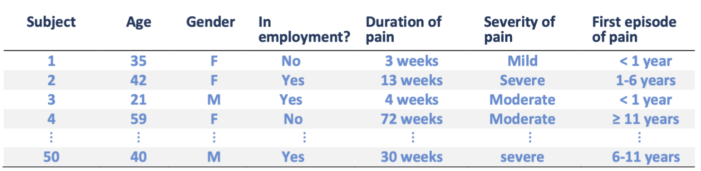
    - each row represents measurements of a SINGLE case/patient
    - Each column refers to a characteristic of interests, called **variable**
    - each datum
      - is the value of a single variable for a single case
      - also known as **observation**
- ### Types of variables
  - **categorical**
    - Nominal
      - can't be ranked
        - e.g. dog species
        - UG majors
    - Ordinal 
      - can be ranked 
        - No. 1, 3, 8 typhoon signals
  - **Numerical**
    - Discrete
      - integer number
        - often by counting 
          - e.g. how many courses did you enroll
    - continuous
      - Real number
        - often from measurements
          - e.g. temperature
- ### Why care about types of data
  - decide how to interpret the data from the variable
    - In $R$, categorical variables are declared as **factors** and their possible values are **levels**
      ```r
      > x = c(1,2,3,4,5)
      > x
      [1] 1 2 3 4 5
      > y = as.factor(x)
      > y
      [1] 1 2 3 4 5
      Levels: 1 2 3 4 5
      ```
  - decide the appropriate statistical analysis
    - certain analyses may not be appropriate for certain data types:
      - e.g. we can't find average of categorical data
- ### data presentation (tabular and graphical summary)
  - presenting numerical data:
    - [frequency table](../../../notes/frequency_table.md)
    - histogram
    - [line chart](../../../notes/line_chart.md)
    - boxplot
  - presenting categorical data:
    - frequency table
    - pie chart
    - [bar chart (similar to historgram)](../../../notes/bar_chart.md)
- ### Data presentation (numerical)-**Center**:
  - **Sample mean and sample median**
    - suppose we have $n$ data, which is the observations in a sample. 
      - they are labeled by $x_1, x_2, x_3,..., x_n$
    - **Sample mean:**
      - the average of data
      - $\overline{x} = \frac{1}{n}\sum_{i = 1}^{n}{x_i} = \frac{x_1 + x_2 + ... + x_n}{n}$
      - sensitive to outliners
      - to prevent outliners while calculating mean, use **trimmed mean**:
        - it is computed by trimming away a certain percent of both the smallest and largest set of values in sample.
        - for example, the 10% trimmed mean $\overline{x}_{tr(10)}$ is calculated by eliminating the largest 10% and smallest 10% then compute the average.
    - **Sample median:**
      - The middle point of ordered data
      - Given that the data are $x_1 \leq x_2 \leq ... \leq x_n$ arranged in increasing order of magnitude
      - Then the sample median is:
      >$$\tilde{x} = 
      >\begin{cases}
      >x_{\frac{n + 1}{2}},\\
      >\frac{1}{2}(x_{\frac{n}{2}} + x_{\frac{n}{2} + 1}), \\
      >\end{cases}
      >$$  
      - insensitive to outliners 
    - 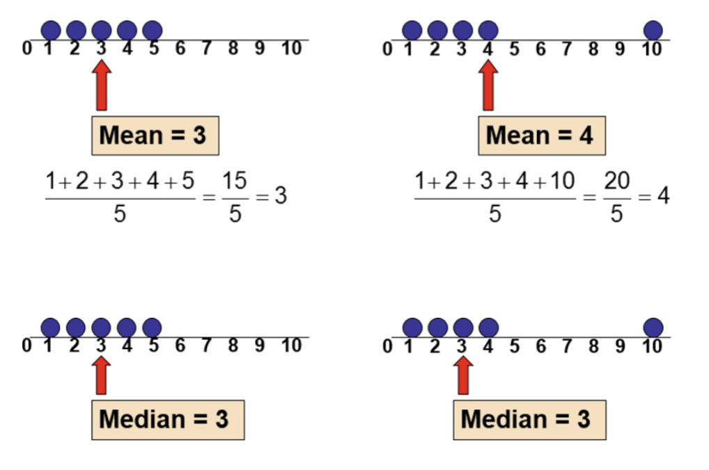
- ### Data Presentation (Numerical)-**Sample variance**
  - **Sample variance and disspersion**
    - let the data values be $x_1, x_2, x_3, ..., x_n$, then 
    - **sample variance:**
      - $s^{2}_{n - 1} = \frac{1}{n - 1}\sum_{i = 1}^{n}({x_{i} - \overline{x}})$
      - it describes the dispersion and spread of data
        - why? why $s^{2}_{n - 1}$ describes dispersion? idk?
      - what $n - 1$?
    - **sample standard deviation:**
      - is the square root:
      - $s_{n - 1} = \sqrt{s^{2}_{n - 1}}$
- ### Data Presentation (Numerical)-**Quartiles and IQR**
  - how to find quartiles
    - total number is **odd:**
    >1. Sort the data from smallest to largest and mark the median
    >2. Create a new data segment 
    >     - consists of the first half of the full sorted list
    >     - includes the median of the full sorted list
    >       - as its last element in the new segment
    >     - The median of the new data segment is called:
    >       - the first quartile
    >       - aka $Q_1$
    >     - it is the 0.25 quantile
    >3. Back to the full sorted list. Create another new data segment 
    >     - consists of the second half of the full sorted list
    >     - includes the median of the full sorted list
    >       - as its first element in the new segment
    >     - The median of the new data segment is called:
    >       - the third quartile
    >       - aka $Q_3$ 
    >     - it is the 0.75 quantile
    >4. The median is $Q_2$
    >     - which is the 0.50 quantile 
    - total number is **even:** (?)
  - **range:**
    - the difference between the maximum data value and the minimum data value
      - **Range = Max - Min**
  - **Inter-Quartile range (IQR):**:
    - the difference between the third quartile and the first quartile
      - **IQR = $Q_3 - Q_1$**
  - **Outlier:**
    - a data point in a data set is called the **outlier** if:
      - Observation $\geq Q_3 + 1.5 \times$ **IQR**
      - Observation $\leq Q_1 - 1.5 \times$ **IQR**
    - basically data that are:
      - much larger or much smaller than majority of the data
- ### Data Presentation (Graphical)-**Boxplot**
  - **Boxplot:**
    - show:
      - minimum
      - first quartile $Q_1$
      - second quartile (median) $Q_2$
      - third quartile $Q_3$
      - maximum
      - outliers
  - illustrations (only 4 cases):
    - 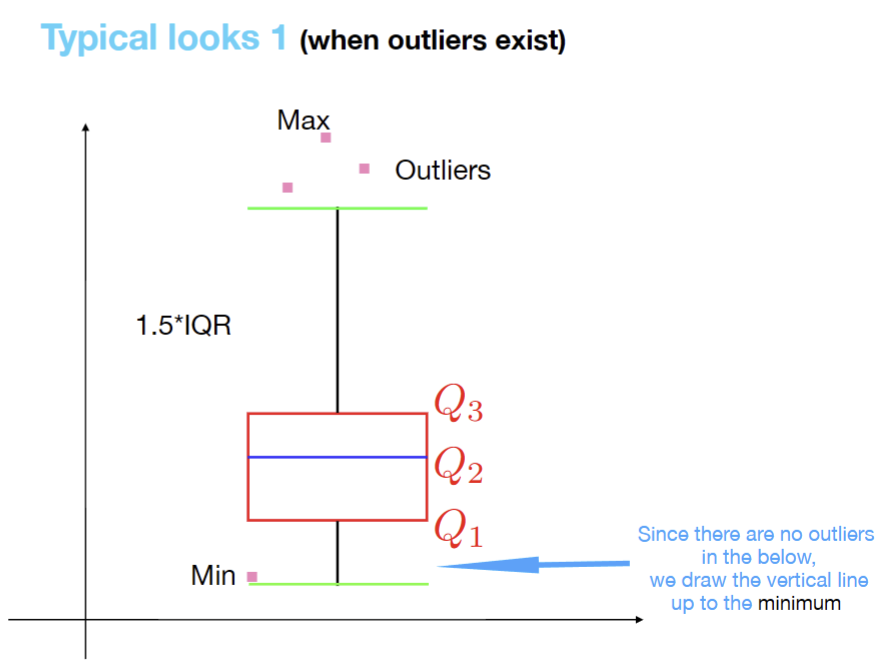
    - 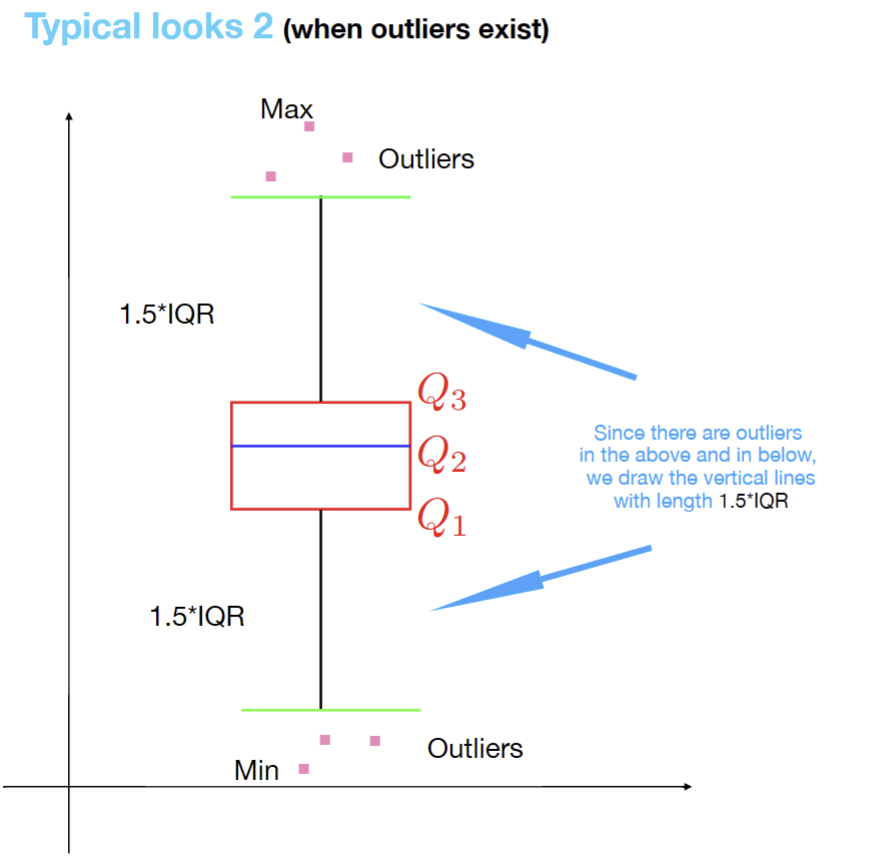
    - 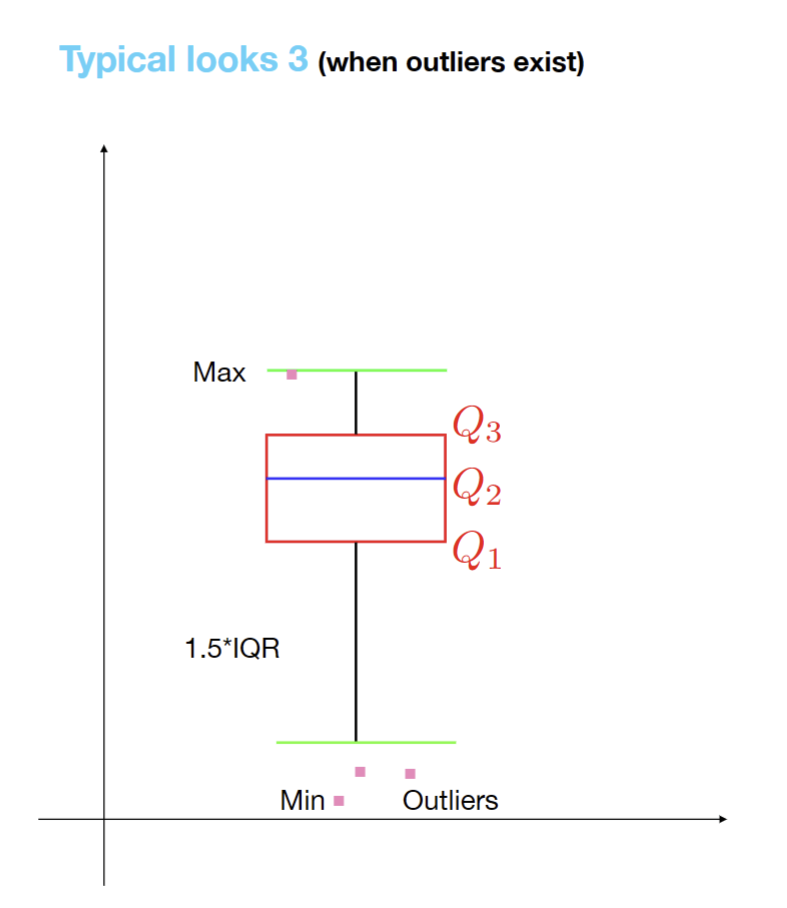
    - 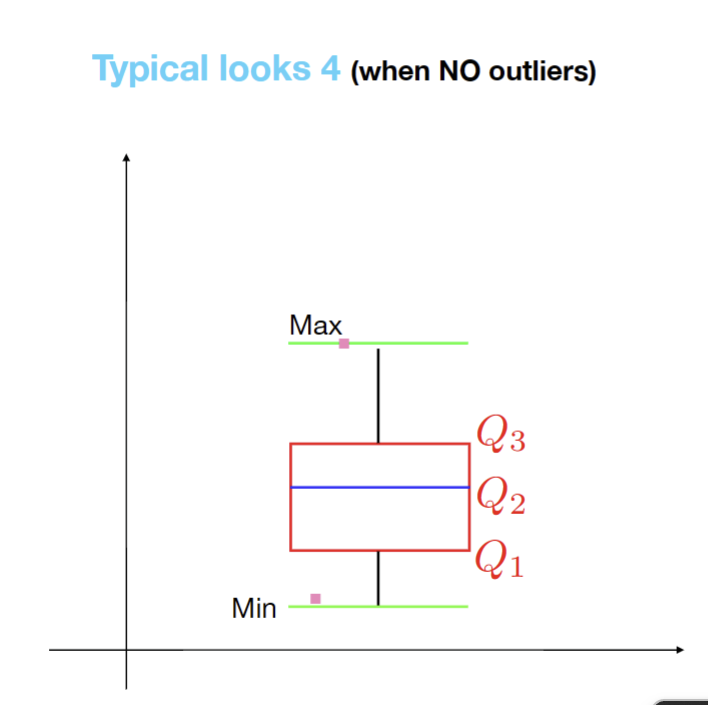
  - Algorithm for drawing a boxplot:
  >1. Draw three horizontal lines corresponding to:
  >    - $Q_1$
  >    - $Q_2$
  >    - $Q_3$
  >2. Mark max and min
  >3. Draw two vertical lines
  >    - their length depends on whether there's outlier according to the **typical looks** above 
  >4. Draw two horizontal lines at the end 
  >5. mark all the outliers
  - $R$ function for boxplot:
    - Example: 
    >````
    >12, 13, 14, 15, 16, 17, 18, 18, 19, 20, 21, 22, 22, 23, 24, 25, 26, 26, 27, >28, 29, 29, 31, 32, 33, 34, 35, 42, 47.
    >````
    >````r
    >x <- c(12, 13, 14, 15, 16, 17, 18, 18, 19, 20, 21, 22, 22, 23, 24, 25, 26, >26, 27, 28, 29, 29, 31, 32, 33, 34, 35, 42, 47)
    >boxplot(x, horizontal = TRUE)
    >````

# Lecture 3 (probability)
- ## relation between probability and statistics
  - **probability** is the tool to describe characteristics of a random sample given knowing the population characteristics (? what does "given knowing the population characteristics" mean lol?)
  - **Statistics** is the tool to describe characteristics of an unknown population by a random sample of data
- ## outline:
  - ### Fundamentals of probability:
    - random experiment outcomes, event, sample space
    - for basic operations on events: 
      - union 
      - intersection 
      - complement 
      - symmetric difference
    - properties of events:
      - associative law
      - distributive law 
      - deMorgan's law
    - Kolmogorov's definition of probability
- ## Basic concepts:
  - (Random) experiment/trial is a procedure that generates an uncertain **outcome**
      - Example:
        - throwing a dice
        - draw a card from a deck of 52 cards
    - **sample space** $\Omega$ is the set of all possible outcomes of an experiment
      - example:
        - face of 1 to 6 
        - 52 cards
    - **Event** is a set of outcomes.
    - If the outcome of an experiment lies in event $A$, we say that event $A$ occurs (?)
      - Example:
        - $A = \{ \text{odd number faces} \} = {1, 3, 5}; \{\text{a card of Heart}\}$
      - **motivation:** we may be interested in the occurence of a certain events rather than the occurence of a specific element in the sample space
  - 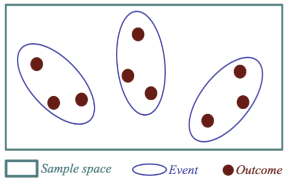
  - **remark:** if the sample space is very large or infinite. We write it with a statement or rule method:
    - example:
      - $S = \{x | x \text{ is a city with population over 10 million} \}$
      - $S = \{(x, y) | x^2 + y^2 \leq 4 \}$ 
        - which describes the sample space of points on the boundary or within a circle with radius of 2
      - $E = \{(x, y) | x^2 + y^2 \leq 1 \}$
        - points within a smaller circle
- ## Operation rules of events/sets
  - $A \cap B$ denotes the intersection
    - aka $A \land B$ or $A$ AND $B$
    - 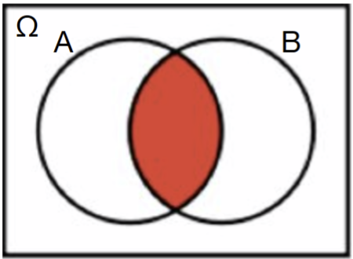 
  - $A \cup B$ denotes the union
    - aka $A \lor B$ or $A$ OR $B$
    - 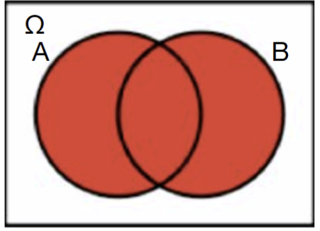
  - $A^c$ denotes the compliment
    - aka $\neg A$ or $\overline{A}$ or NOT $A$
    - 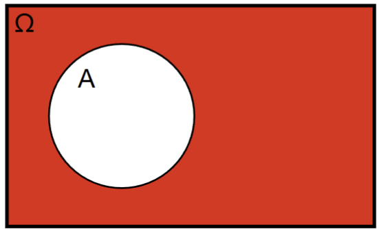
  - $A - B$ denotes the difference 
    - aka $A \land B^c$
    - 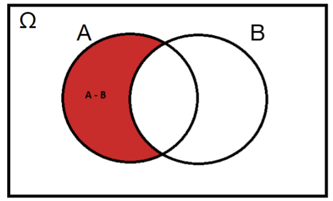
  - $A \Delta B$ denotes the symmetric difference
    - aka $(A - B) \cup (B - A)$ or $(A \cup B) - (A \cap B)$
    - 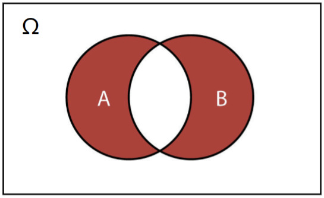
  
- ## Useful concepts
  - empty event:
    - denoted by $\emptyset$ or $\{\}$
  - disjoint event:
    - denoted by $A \cap B = \emptyset$
  - **mutually exclusive** events $A_1, A_2, ..., A_k$ 
    - if any pair of them are disjoint
  - **exhaustive:**
    - if the union of events $A_1, A_2, ..., A_k$ is $\Omega$
- ## Fundamental laws
  - ### Commutative law:
    - can swap position
    - $A \cap B = B \cap A$, $A \cup B = B \cup A$
  - ### Distributive law:
    - operators outside () distributes when breaking ()
    - $(A \cup B) \cap C = (A \cap C) \cup (B \cap C)$ 
    - $(A \cap B) \cup C = (A \cup C) \cap (B \cup C)$ 
  - ### Associative law:
    - can swap positioning of () is operators are the same
    - $(A \cap B) \cap C = A \cap (B \cap C)$
    - $(A \cup B) \cup C = A \cup (B \cup C)$
  - ### De morgan's law
    - how it behaves when compliment breaks and go inside ()
    - $(A \cap B)^c = A^c \cup B^c$
    - $(A \cup B)^c = A^c \cap B^c$
- ## Definition of probability: (Kolmogorov’s axiom of probabilities)
  - A function $P: \text{ Events in } \Omega \to \mathbf{R}$ is a **probability function** if it satisfy the following axioms: (?)
    >1. $0 \leq P(E) \leq 1$ for any event $E \in \mathcal{A}$ 
    >2. $P(\Omega) = 1$
    >3. if $E_1, E_2, ...$ are mutually exclusive events ($n$ can be $\infty$)
    >$$
    >P\Biggl(\bigcup_{i = 1}^{n}{E_i}\Biggr) = \sum_{i = 1}^{n}{P(E_i)}
    >$$

  - a **sample space** together with a **collection of events** and a **probability function** is called a **probability space:** ($\Omega, \mathcal{A}, P$)
- ## Properties of probability
  - $P(A^c) = 1 - P(A)$
  - $P(\emptyset) = 0$ (?) what is the motivation of this property what does it do?
  - if $A \subset B \implies P(A) \leq P(B)$ (?)
  - **Union bound** (?)
    - $P(A \cup B) \leq P(A) + P(B)$ 
    - $P(A \cup B) = P(A) + P(B) - P(A \cap B)$ 
    - $P(A \cap B) \geq 1 - P(A^c) - P(B^c)$ (????)

- ## Sample space with equally likely outcomes:
  - if $S$ is a sample space with $S = \{\omega_1, \omega_2, ... \omega_N\}$
    - such that every possible outcome $\omega_i, \omega_j \in S$
    - we have $P(\omega_i) = P(\omega_j)$
  - then, for any event $E$
    - the probability of event $E$ can be computed by the formula:
    >$$
    >P(E) = \frac{\text{Number of outcomes in } E}{\text{Number of outcomes in } S}
    >$$

- ## Counting
  - learn counting techniques
    - motivation: count outcomes systematically to solve complex situations
  - ### Addition Principle

    >$$
    >n \text{ different ways:} \\  
    >\begin{cases}
    >\text {There are } m_1 \text{ outcomes from the 1st way } \\
    >\text {There are } m_2 \text{ outcomes from the 2nd way } \\
    >\dots
    >\text {There are } m_n \text{ outcomes from the n-th way } \\
    >\end{cases}
    >$$

    - The total number of outcomes:
      - $N = m_1 + m_2 + \dots + m_n$
  - ### Multiplication principle:
    >$$
    >n \text{ different STEPS: } \\  
    >\begin{cases}
    >\text {There are } m_1 \text{ outcomes from the 1st step } \\
    >\text {There are } m_2 \text{ outcomes from the 2nd step } \\
    >\dots
    >\text {There are } m_n \text{ outcomes from the n-th step } \\
    >\end{cases}
    >$$
    - The total number of outcomes:
      - $N = m_1m_2\dots m_n$
  - ### Permutation and combination
    - **Definition:** a permutation is an **ordered** arrangement of all or part of a set of objects
    - In general: each permutation can be performed in $n$ steps:
      - <u> Step 1: </u> Choose 1st object, we have $n$ option 
        - option refers to the object's position in the arrangement
      - <u> Step 2: </u> Choose 2nd object, we have $n - 1$ option
      - ...
      - <u> Step n: </u> Choose last object, we have $1$ option
    - Thus, they can be arranged in $n \times (n - 1) \times (n - 2) \times \dots \times 1$ ways 
    - **Definition:** for any non-negative integer $n$: 
      - $n!$ is defined as 
        - $n \times (n - 1) \times (n - 2) \times \dots \times 1$
        - with special case $0! = 1$
    - **Theorem:** the number of permutations of $n$ objects is $n!$
    - **Theorem:** The number of permutations of $n$ distinct objects taken $r$ at a time is:

      >$$
      >\frac{n!}{(n - r)!}
      >$$
    
- ## Conditional probability:
  - **Remarks**: 
    - **Sometimes**, the information that event $B$ has occured would:
      - <u>influences</u> the probability that $A$ will occur
    - we can "update" the probability of an event $A$ happening
      - after obtaining some "additional" information from $B$ 
  - **Conditional probability** is the probability of one event <u>given that another event (a conditional event) has occured</u>
    - The conditional probability of $A$ given that an event $B$ has already occured is denoted by $P(A|B)$
  - **Definition:** if $P(B) > 0$, the conditional probability of $A$ given $B$ is:

    >$$
    >P(A|B) = \frac{P(A \cap B)}{P(B)}
    >$$
    - another way of thinking:
      - the sample space changed from $\Omega$ to $B$ when conditioned on $B$
      - $P(A|B) + P(A^c|B) = 1$
      - 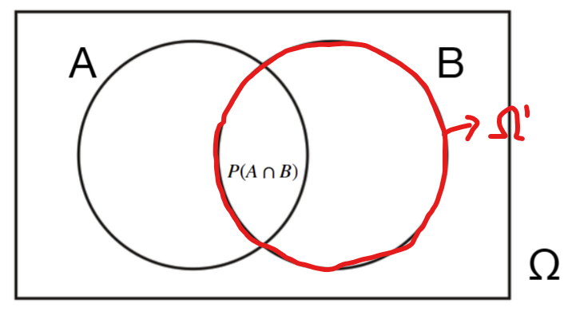

  - Multiplicative rule (product rule):
      - $P(A \cap B) = P(B|A)P(A)$ (??)
        - shouldn't it be $P(A \cap B) = P(A|B)P(B)$ ?
      - $P(A|B) = P(B|A)$
  - Generalization to three events:
    - for events $A, B, C$, we have:
      - $P(A \cap B \cap C) = P(A)P(B|A)P(C|(A \cap B))$ (????Why?)
- ## Independence
  - Note that it is possible that an event $B$ occuring does not influence the probability of $A$ occuring
  - **For example,** a fair coin is tossed twice. Consider the following events: $A, B$: the event that a head occurs on the first/second toss, respectively.
    - intuitively, there is no relationship between the occurrence of $A$ and $B$ 
    - **mathematically**, $A$ and $B$ are independent:

      >$$
      >\iff P(A|B) = P(A), \quad P(B|A) = P(B) \\
      >\iff P(A \cap B) = P(A|B)P(B) = P(B|A)P(A) = P(A)P(B) 
      >$$

    - **Definition**: 
      - if $P(A \cap B) = P(A)P(B)$
        - then the events $A$ and $B$ are said to be **independent**
      - if they are **not independent**
        - then they are said to be **dependent**
      - if $P(B) > 0$, then $A, B$ are indepdendent if $P(A|B) = P(A)$
        - in other words, know that $B$ occurs 
          - does not affect the probability of $A$ occuring
    - Proposition:
      - If $A, B$ are independent, then $A$ and $B^c$ are also independent
        - proof:

          >$$
          >\begin{aligned}
          >P(A \cap B^c) &= P(A) - P(A \cap B)  \\
          >&= P(A) - P(A)P(B) \\
          >&= P(A)(1 - P(B)) \\
          >&= P(A)P(B^c)
          >\end{aligned}
          >$$

        - **Remark:**
          - the following statements are equivalent:
            - $A$ and $B$ are independent
            - $A$ and $B^c$ are independent
            - $A^c$ and $B$ are independent
            - $A^c$ and $B^c$ are independent
          - $A$ and $B$ are independent $\iff P(A \cap B) = P(A)P(B)$
          - $A$ and $B$ are disjoint $\iff A \cap B = \emptyset$
  - ### Mutually independent:
    - **definition:** events $A$, $B$ an $C$ are said to be mutually independent if and only if the following are all true:
      >$$
      >\text{ Mutually independent }
      >\begin{cases}
      >\text{ Pairwise independent }
      >\begin{cases}
      >P(A \cap B) = P(A)P(B) \\
      >P(B \cap C) = P(B)P(C) \\
      >P(C \cap A) = P(C)P(A) \\
      >\end{cases} \\
      >\quad \quad \quad P(A \cap B \cap C) = P(A)P(B)P(C) \\
      >\end{cases}
      >$$

    - **Remark 1:** Pairwise independent may not mean Mutually independent:
      - example:
        - $S = \{s_1, s_2, s_3, s_4\}$ with 4 equally likely outcomes
        - events: $A = \{s_1, s_2\}$, $B = \{s_1, s_3\}$, $C = \{s_1, s_4\}$
          >$$
          >P(A \cap B) = \frac{1}{4} = P(A)P(B) \\
          >P(A \cap C) = \frac{1}{4} = P(A)P(C) \\
          >P(B \cap C) = \frac{1}{4} = P(A)P(C) \\
          >
          >\text{ So they are pairwise independent } \\
          >\quad \\ 
          >\text {However, } P(A \cap B \cap C) = \frac{1}{4} \neq P(A)P(B)P(C) \\
          >\text{ So they are not mutually independent } \\
          >$$
    - **Remark 2:** $\quad P(A \cap B \cap C) = P(A)P(B)P(C)$ does not mean pairwise independent
      - Example:
        - Suppose $A = B$ and $C = \emptyset$
        - Although $A \cap B \cap C = \emptyset$, which results in
          - $P(A \cap B \cap C) = P(A)P(B)P(C)$
        - the events $A$ and $B$ are not independent
- ## Law of total probability
  - motivation: how to calculate the probability of event $A$ in some complicated scenario
  - by the venn diagram, $A \cap B$ and $A \cap B^c$ are disjoint
  - Therefore, we can write event $A$ as:
    - $A = (A \cap B) \cup (A \cap B^c)$
    - so:
    - $P(A) = P(A \cap B) + P(A \cap B^c)$
    - then have the result often known as "law of total probability":
    - for $0 < P(B) < 1$:
      - $P(A) = P(A|B)P(B) + P(A|B^c)P(B^c)$
  - Note that $B$ and $B^c$ forms a partition of the sample space $\Omega$ in the formula:
    - $P(A) = P(A|B)P(B) + P(A|B^c)P(B^c)$
    - as:
      - $B \cup B^c = \Omega$ and $B \cap B^c = \emptyset$
  - Events $B_1, B_2, \dots, B_k$ is a called a **partition** if:
    - of the sample space $\Omega$:
      - they are mutually exclusive:
        - $(B_i \cap B_j = \emptyset, \quad i \neq j, \quad i, j = 1, \dots, k )$ 
      - they are exhaustive:
        - $(B_1, B_2, \dots, B_k = \Omega)$
      - 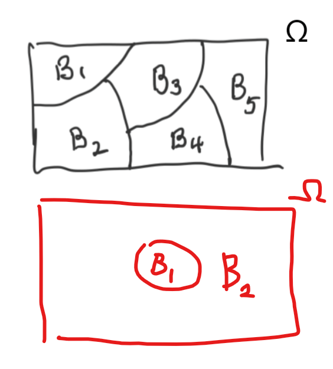
      - <u>Law of total probability:</u>
        - for partition $B_1, B_2, \dots, B_k$:
          - $P(A) = P(B_1)P(A|B_1) + P(B_2)P(A|B_2) + \dots + P(B_k)P(A|B_k)$
- ## Bayes theorem:
  - motivation: relationship between $P(B|A)$ and $P(A|B)$ 
    - e.g. find $P(B|A)$ given $P(A|B)$
  - **Theorem:** 
    - if $P(A) > 0, \quad P(B) > 0$:
      >$$
      >P(B|A) = P(A|B)\frac{P(B)}{P(A)} = \frac{P(A|B)P(B)}{P(A|B)P(B) + P(A|B^c)P(B^c)}
      >$$

  - $P(B)$ is called the {{prior probability}}
  - $P(B|A)$ is called the {{posterior probability}}
  - ### Generalized version:
  - **Theorem:** 
    - if $B_1, B_2, \dots, B_k$ is a partition and $P(B_i) > 0$

      >$$
      >P(B_i|A) = \frac{P(A|B_i)P(B_i)}{\sum_{j = 1}^{k}{P(A|B_j)P(B_j)}}
      >$$
    