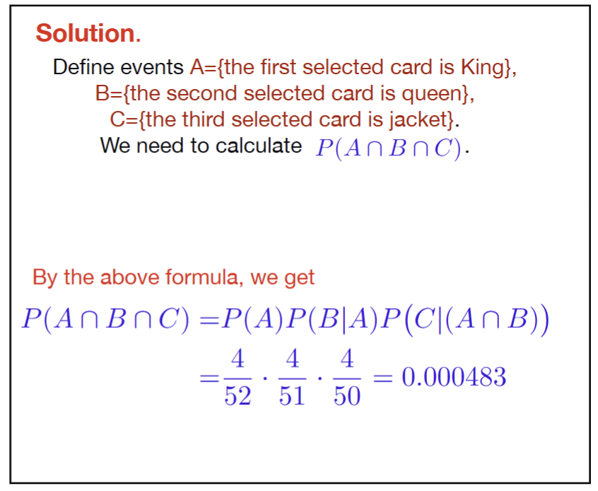

---
aliases:
  - problem
  - lecture notes 2 probability
  - conditional probability 5
tags:
  - flashcard/active/stat
  - MATH2411
  - status/incompleted
---

# Problem 
- Three cards are selected successively at random and removed without replacement from a standard deck of 52 playing cards. Calculate the probability of receiving, in order, a king, a queen, a jacket.

# Solution

# Official solution
