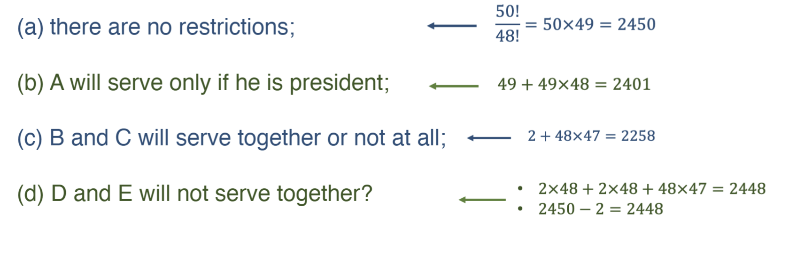

---
aliases:
  - problem
  - lecture notes 2 probability
  - counting 2
tags:
  - flashcard/active/stat
  - MATH2411
  - status/incompleted
---

# Problem 
- A president and a treasurer are to be chosen from a student club
consisting of 50 people.
- How many different choices of officers are possible if
  - (a) there are no restrictions;
  - (b) A will serve only if he is president;
  - (c) B and C will serve together or not at all;
  - (d) D and E will not serve together?

# Solution 

# Official solution 
