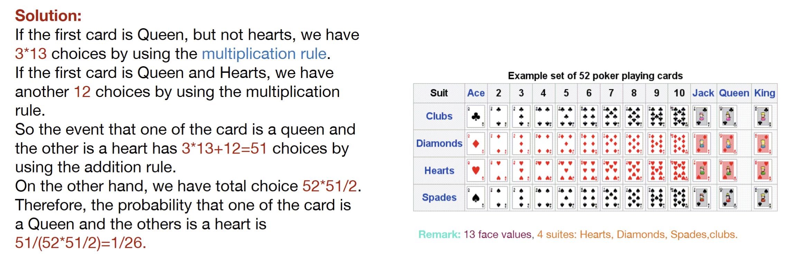

---
aliases:
  - problem
  - lecture notes 2 probability
  - counting 3
tags:
  - flashcard/active/stat
  - MATH2411
  - status/incompleted
---

# Problem
- Now we draw two cards randomly at once, what is the probability that one of
the card is a Queen and the other is a heart?

# Solution 

# Official Solution
