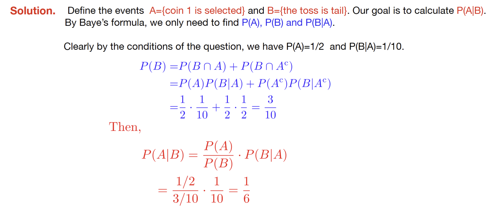

---
aliases:
  - problem
  - lecture notes 2 probability
  - Bayes theorem 2
tags:
  - flashcard/active/stat
  - MATH2411
  - status/incompleted
---

# Problem
- There are two coins. When tossed, coin 1 shows tail with probability 1/10 and coin 2 shows tail
with probability 1/2. Suppose that we randomly pick up one of them and toss it. If the result is tail, then
what is the probability that coin 1 is selected?

# Solution

# Official solution:

