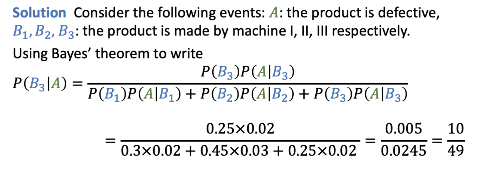

---
aliases:
  - problem
  - lecture notes 2 probability
  - Bayes Theorem 5
tags:
  - flashcard/active/stat
  - MATH2411
  - status/incompleted
---

# Problem 
- (Defective product - revisited)
In a certain assembly plant, there are only three machines, I, II and III, which make 30%,
45%, and 25%, respectively, of the products. It is known from past experience that 2%,
3%, and 2% of the products made by each machine, respectively, are defective.
Now, if a product was chosen randomly and found to be defective, what is the probability
that it was made by machine III?

# Solution 

# Official solution
