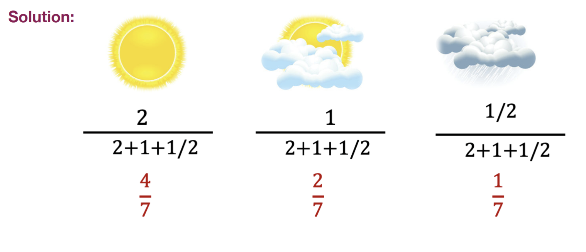

---
aliases:
  - problem
  - lecture notes 2 probability definition example 1
tags:
  - flashcard/active/stat
  - MATH2411
  - status/incompleted
---

# Problem
- Suppose there are three weather statuses ONLY: Sunny, Cloudy, Rainy.
- It is known that tomorrow in a city X, the probability of Sunny is 2 times that of Cloudy,
- and the probability of Rainy is only half of that of Cloudy.
- What is the probability of each status?

# Solution

# Official solution:

