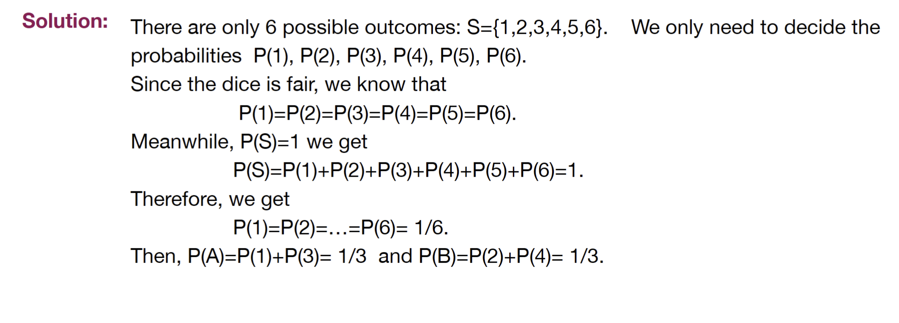

---
aliases:
  - problem
  - lecture notes 2 probability definition example 2
tags:
  - flashcard/active/stat
  - MATH2411
  - status/incompleted
---

# Problem
- We roll a fair six-faced dice randomly and we consider the number of the random outcome.
- Let $A = \{1, 3\}$, and $B = \{2, 4\}$ be two events
- By Kolmogorov’s axiom of probabilities, what are $P(A)$ and $P(B)$

# Solution 

# Official Solution
