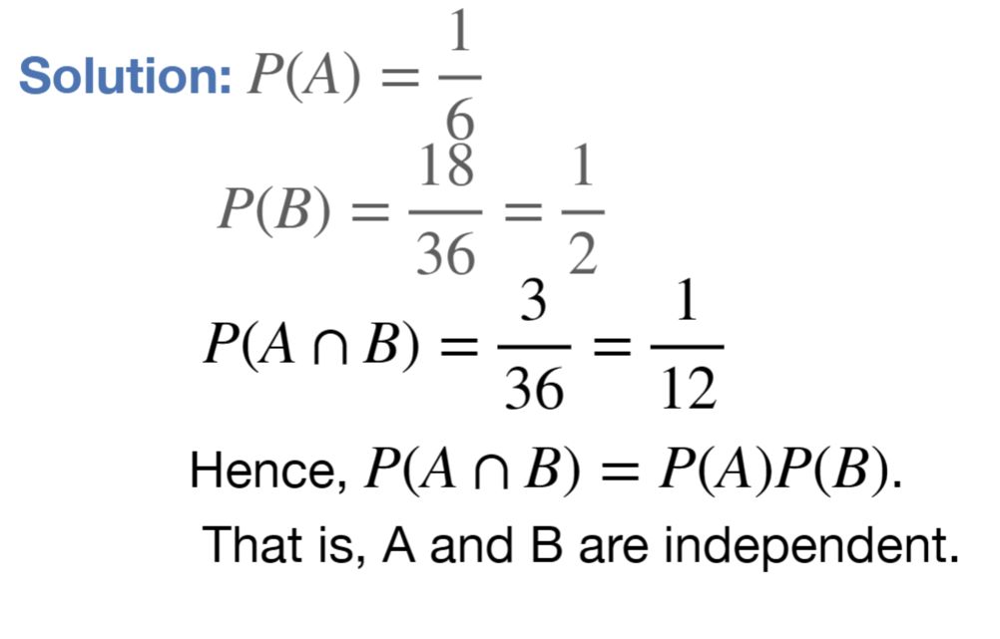

---
aliases:
  - problem
  - lecture notes 2 probability
  - independence 2
tags:
  - flashcard/active/stat
  - MATH2411
  - status/incompleted
---

# Problem 
- A red die and a white die are rolled. Let event A={4 on the red die} and
event B={sum of dice is odd}. Are A and B independent?

# Solution 

# Official solution:
