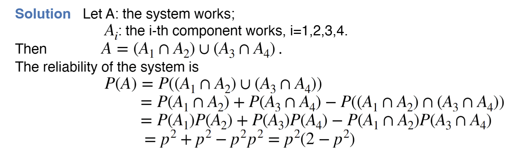

---
aliases:
  - problem
  - lecture notes 2 probability
  - independence 2
tags:
  - flashcard/active/stat
  - MATH2411
  - status/incompleted
---

# Problem 
- Reliability = (probability of working)
An electrical system consists of 4 components as illustrated in the
figure.
Assume that the reliability of each component is p and the
components work independently. (0<p<1)
What is the reliability of the system?

# Solution 

# official solution:
