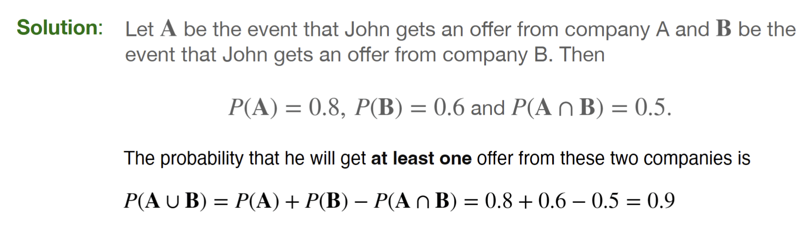

---
aliases:
  - problem
  - lecture notes 2 probability property example 2
tags:
  - flashcard/active/stat
  - MATH2411
  - status/incompleted
---

# Problem
John is going to graduate from an industrial engineering department in a university by the end of the
semester. After being interviewed at two companies he likes, he assesses that his probability of getting an
offer from company A is 0.8, and his probability of getting an offer from company B is 0.6. If he believes
that the probability that he will get offers from both companies is 0.5, what is the probability that he will get
at least one offer from these two companies?

# Solution 

# Official solution 
