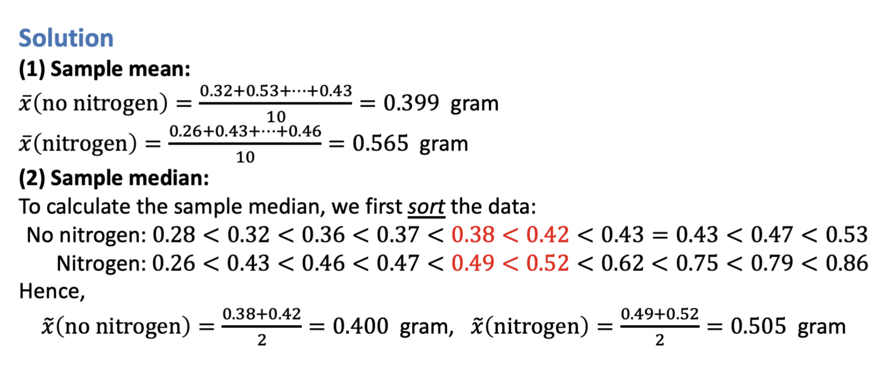
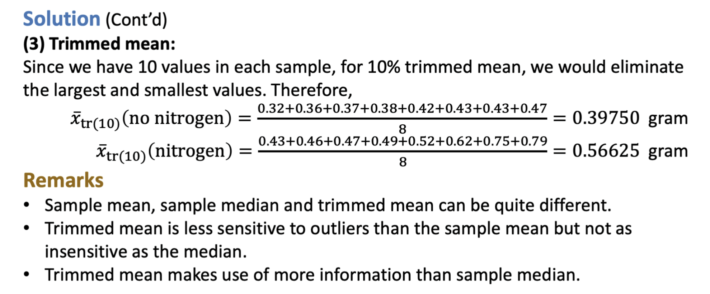

---
aliases:
  - problem
  - lecture notes 1 example on sample mean and sample median
tags:
  - flashcard/active/stat
  - MATH2411
  - status/incompleted
---

# Problem
- Two samples of 10 northern red oak seedlings were planted in a greenhouse, one containing seedlings treated <u>with nitrogen</u> and the other containing seedlings <u>with no nitrogen</u>. All other environmental conditions were held constant.
- The stem weights in grams were recorded after the end of 140 days. The data are given  in the table below.
- Table: stem weights in grams:

|No Nitrogen|0.32|0.53|0.28|0.37|0.47|0.43|0.36|0.42|0.38|0.43|
|-|-|-|-|-|-|-|-|-|-|-|
|Nitrogen|0.26|0.43|0.47|0.49|0.52|0.75|0.79|0.86|0.62|0.46|

- Calculate 
  - sample mean
  - sample median
  - trimmed mean

# Solution

# Official Answers: 
- 
- 
