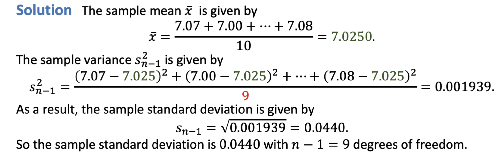

---
aliases:
  - problem
  - lecture notes 1 example on sample mean and sample median
tags:
  - flashcard/active/stat
  - MATH2411
  - status/incompleted
---

# Problem
- An engineer is interested in testing the bias in pH meter. Data are collected on the meter by measuing the pH of neutral substance (pH = 7.0).
- A sample size of 10 is taken
  - result:
    >````
    >7.0     7.00    7.10    6.97    7.00    7.03    7.01    7.01    6.98    7.08
    >````
- calculate the sample variance and sample deviation
# Solution

# Official Answers: 

(what is degree of freedom?)