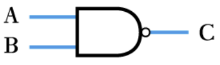

---
aliases:
  - NAND gate
tags:
  - flashcard/active/ass
  - COMP2611
---

## `NAND` gate
- it's a `NOT-AND` gate, completely opposite to [`AND` gate](./AND_gate.md)
- ### circuit symbol
  - 
- ### Truth table:
| A   | B   | C   |
| --- | --- | --- |
| 0   | 0   | 1   |
| 0   | 1   | 1   |
| 1   | 0   | 1   |
| 1   | 1   | 0   |
- ### Boolean expression
    > $C = \overline{A \cdot B}$
    