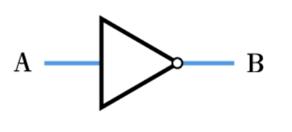

---
aliases:
  - NOT gate
tags:
  - flashcard/active/ass
  - COMP2611
---

- ## `NOT` gate
- ### circuit symbol
  - 
- ### Truth table:
| A   | B   |
| --- | --- |
| 0   | 1   |
| 1   | 0   |
- ### Boolean expression
    > $B = \overline{A}$
    