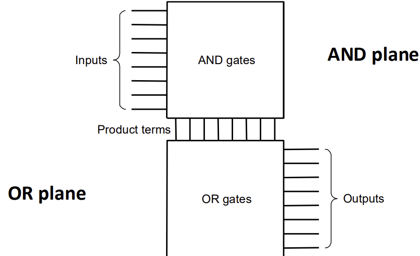
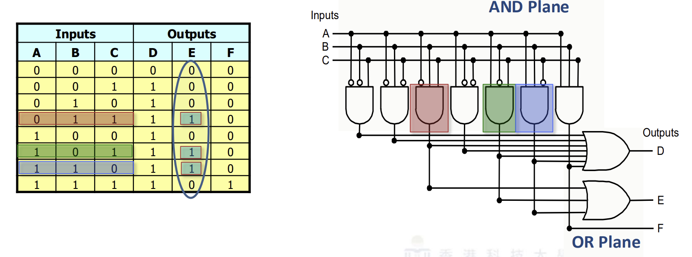
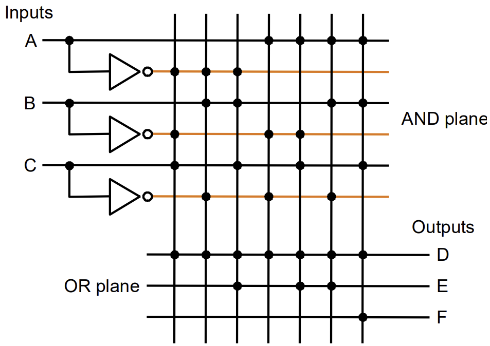

---
aliases:
  - PLA
  - Programmable Logic Array 
tags:
  - flashcard/active/ass
  - COMP2611
---

# PLA (programmable logic array)
- a PLA refers to the gate-level implementation of the two-level representation for any set of logic functions, which corresponds a truth table with multiple output columns

# Example 1
- A PLA corresponds to the sum-of-products representation:

# Example 2
- Show a PLA implementation of this example:

| Inputs |       |       | Outputs |       |       |
| :----: | :---: | :---: | :-----: | :---: | :---: |
| **A**  | **B** | **C** |  **D**  | **E** | **F** |
|   0    |   0   |   0   |    0    |   0   |   0   |
|   0    |   0   |   1   |    1    |   0   |   0   |
|   0    |   1   |   0   |    1    |   0   |   0   |
|   0    |   1   |   1   |    1    |   1   |   0   |
|   1    |   0   |   0   |    1    |   0   |   0   |
|   1    |   0   |   1   |    1    |   1   |   0   |
|   1    |   1   |   0   |    1    |   1   |   0   |
|   1    |   1   |   1   |    1    |   0   |   1   |

- Sum-of-product representation:
$$
D = \overline{A} \cdot \overline{B} \cdot C + \overline{A} \cdot B \cdot \overline{C} + \overline{A} \cdot B \cdot C + A \cdot \overline{B} \cdot \overline{C} + A \cdot \overline{B} \cdot C + A \cdot B \cdot \overline{C} + A \cdot B \cdot C
$$

$$
E = \overline{A} \cdot B \cdot C + A \cdot \overline{B} \cdot C + A \cdot B \cdot \overline{C}
$$

$$
F = A \cdot B \cdot C
$$

- 3 inputs -> 3 rows in the AND plane
- 7 unique product terms with at least one TRUE value in the output -> 7 columns in the AND plane.
- 3 outputs -> 3 rows in the OR plane

- equivalent to above