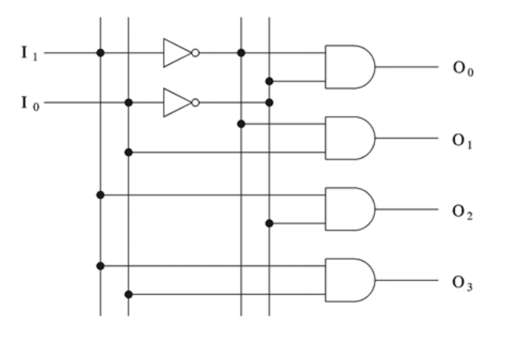

---
aliases:
  - decoder
tags:
  - flashcard/active/ass
  - COMP2611
---

# Decoder
- A decoder ($N$-to-$2^N$ decoder) is a logical block with an $N$-bit input 
and $2^N$ $1$-bit outputs 
- The output corresponds to the input bit pattern is true while all other outputs are false.

|$I_1$|$I_0$|$O_3$|$O_2$|$O_1$|$O_0$|
|-----|-----|-----|-----|-----|-----|
|0    |0    |0    |0    |0    |1    |
|0    |1    |0    |0    |1    |0    |
|1    |0    |0    |1    |0    |0    |
|1    |1    |1    |0    |0    |0    |

- Example: 2-to-4 decoder

# motivation
- basically a selector that "lights-up" only one certain output with given input bit pattern