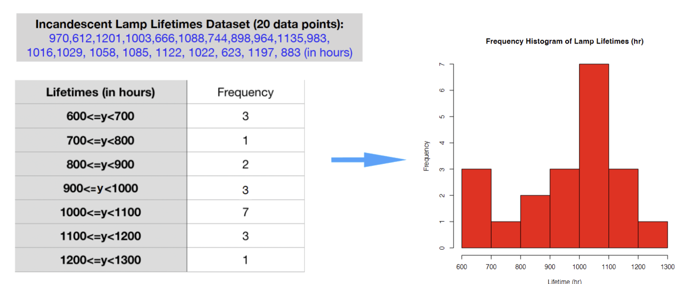

---
aliases:
  - Frequency table
tags:
  - flashcard/active/stat
  - MATH2411
---

# Frequency table 
- a summary table in which the collected data can be arranged into numerically ordered and non-overlapping categories or class intervals 
  - to turn the data into a more useful form 
  - to allow for a quick interpretation of the Data

 

- Non-overlapping, exhaustive intervals, often dividing the range of the data equally
- Histogram is the graphical representaion of a frequency table.

# R-code:
```r
> x =
c(970,612,1201,1003,666,1088,744,898,964,1135,983,
1016,1029, 1058, 1085, 1122, 1022, 623, 1197, 883)
> hist(x,7)
```
```r
res = hist(x,7)
> res
$breaks
[1] 600 700 800 900 1000 1100 1200 1300
$counts
[1] 3 1 2 3 7 3 1
```
```r
> res$breaks
[1] 600 700 800 900 1000 1100 1200 1300
> res$breaks
[1] 600 700 800 900 1000 1100 1200 1300
> res$counts
[1] 3 1 2 3 7 3 1
```
- `$` sign extracts the variable from a list/dataframe
- help() function in R: help(hist) or help(“hist”)