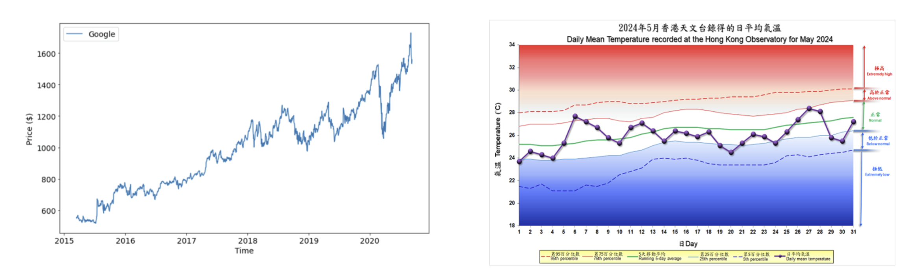
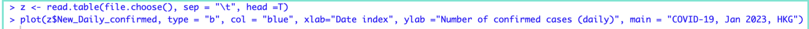

---
aliases:
  - Line chart
tags:
  - flashcard/active/stat
  - MATH2411
---

# Line chart 
- It is a common tool when we study time-series data like stock prices, because it can visualise the trend of such data clearly.

# R-code
- The R function plot() can be used to create a line chart with data related to time.
## Example
