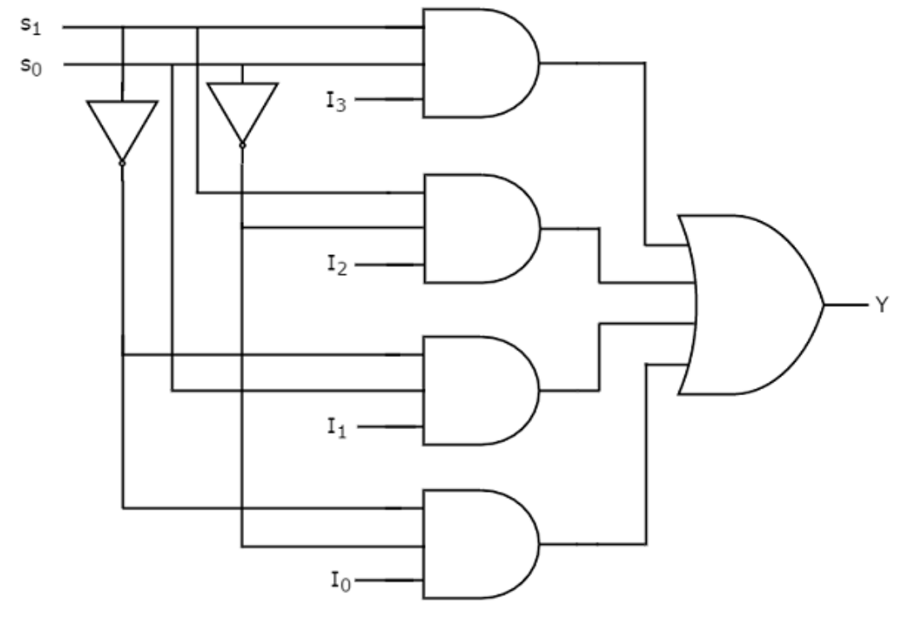

---
aliases:
  - multiplexor
tags:
  - flashcard/active/ass
  - COMP2611
---

# Multiplexor
- A multiplexor (or selector) selects one of the data inputs as output by a control input value
  - example : 4-to-1 multiplexor (4 channels)  

|$S_1$|$S_2$|$O$|
|-----|-----|---|
|0|0|$I_0$|
|0|1|$I_1$|
|1|0|$I_2$|
|1|1|$I_3$|

- for a $2^{n}-to-1$ multiplexor
  - $2^{n}$ data inputs
  - $n$ selection inputs
  - $1$ output
## Example
- 4-to-1 MUX Implementation

- Q: How to implement a higher order MUX, e.g. 8-to-1?