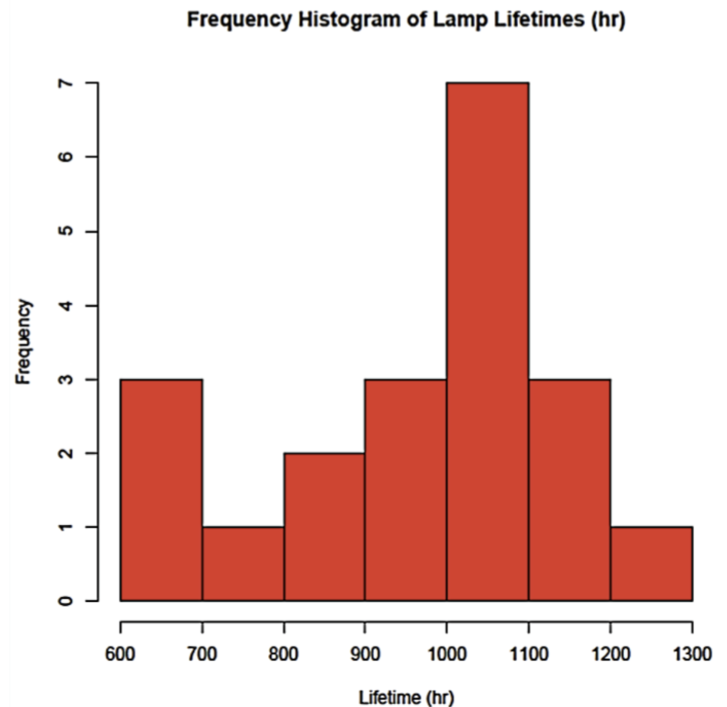

---
aliases:
  - statistics
tags:
  - flashcard/active/stat
  - MATH2411
---

# statistics
- **(Descriptive statistics):** Statistics is a mathematic science related to **data collection, data interpretation, data organisation and data summarisation**

- we can turn raw data into:
  - graphical summaries 
  - numerical summaries:
    - mean
    - median
    - variance
    - etc.
  - etc.

- **(Inferential statistics):** statistics is a method for processing and analyzing the collected data to help reduce uncertainty in decision marking
# Example 1 (Descriptive statistics):
- ## Raw data 
```
Incandescent Lamp Lifetimes Dataset (20 data points): 970,612,1201,1003,666,1088,744,898,964,1135,983,1016, 1029, 1058, 1085, 1122, 1022, 623, 1197, 883 (in hours)
```
- ## graphical summaries


# Example 2 (Inferential statistics):
- ## Raw data 
```
Incandescent Lamp Lifetimes Dataset (20 data points): 970,612,1201,1003,666,1088,744,898,964,1135,983,1016, 1029, 1058, 1085, 1122, 1022, 623, 1197, 883 (in hours)
```

- ## Estimation: 
  - what is the average lifetime of all the lamps the factory produce? (the factor produces 10,000 lamps each day)
    - It is impossible to test the lifetimes for 10,000 lamps!
      - what to do then?
- ## testing:
  - In industrial standards, if the average lifetime is less than 1000 hours, then the production line needs upgrades.
    - how can we tell the factory manager whether the production line needs upgrades?

