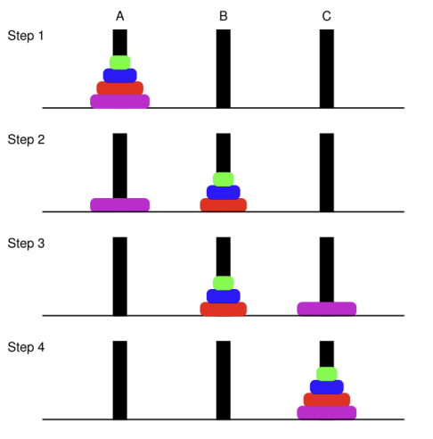

---
aliases:
  - Tower of Hanoi
tags:
  - flashcard/active/algo
  - COMP3711
---

# Tower of Hanoi
- Goal: Move $n$ discs from peg A to peg C
  - One disc at a time
  - Can't put a larger disc on top of a smaller one
- Key things to remember:
  - Reduce a problem to the same problem, smaller sized 
  - base case

# Algorithm:
````cpp
MoveTower(n, peg1, peg2, peg3):
    if (n = 1) then
        Move the only disc from peg1 to peg 3
        return
    else
        // the algorithms is only doing: From "peg1" to "peg3"
        // here peg2 becomes "peg3"
        // which means first transferring the top n - 1 discs to tower 2 first
        MoveTower(n - 1, peg1, peg3, peg2)
        // after moving top n - 1 discs from peg1 to peg2, only the biggest one left at the base at peg1
        // so there's this instruction to specifically move that base to peg3
        Move the only disc from peg1 to peg 3

        // finally transfer the entire n - 1 tower from peg2 to peg3
        MoveTower(n - 1, peg2, peg1, peg3)
````
<u>First call:</u> MoveTower(n, A, B, C)

# Idea
- 

# Analysis
- **Q**: How many steps are needed?
  - Let $T(n)$ be the number of steps needed for $n$ discs.
  - In the recursive algorithm, to solve the problem of size $n$, we:
    - move $n - 1$ discs from peg1 to peg2: $T(n - 1)$
    - move 1 discs from peg1 to peg3: $T(1)$ 
    - move $n - 1$ discs from peg2 to peg3: $T(n - 1)$
    - thus the recurrence counting the number of steps is:
$$
T(n) = 2T(n - 1) + 1 \text{ for } n > 1 \\
T(1) = 1
$$

# Solving the recurrence:
- ## By expansion method
- ## By recursion tree 